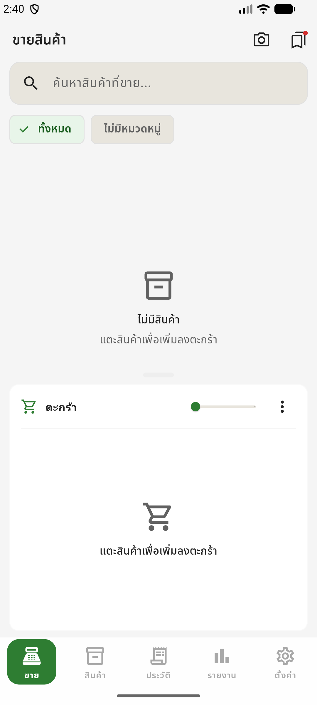
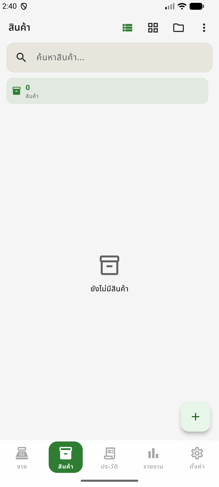
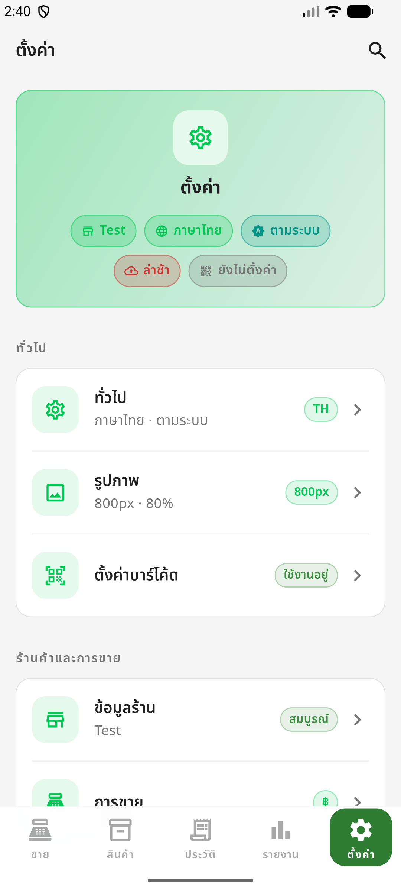

<div align="center">
 
<pre style="background:none;border:none;">
╔═══════════════════════════════════════════════════════════════╗
║                                                               ║
║   🛒  PROMSELL  —  Offline-first Mobile POS for Merchants    ║
║                                                               ║
╚═══════════════════════════════════════════════════════════════╝
</pre>
 
<h1>Promsell — POS Community Edition</h1>
 
<p>
  <strong>An offline-first mobile POS system built with Flutter for small businesses and local merchants.</strong>
</p>
 
<p>
  <a href="https://flutter.dev"></a>
  <a href="https://dart.dev"></a>
  <a href="https://github.com/teeprakorn1/promsell-pos-ce/blob/main/LICENSE"></a>
</p>
 
<p>
  <a href="https://github.com/teeprakorn1/promsell-pos-ce/actions/workflows/ci.yml"></a>
  <a href="https://codecov.io/gh/teeprakorn1/promsell-pos-ce"></a>
  <a href="https://github.com/teeprakorn1/promsell-pos-ce/commits/main"></a>
  <a href="https://github.com/teeprakorn1/promsell-pos-ce"></a>
  <a href="https://github.com/teeprakorn1/promsell-pos-ce/pulls"></a>
</p>
 
<table align="center">
  <tr>
    <td align="center"><b>5</b><br>📱 Tabs</td>
    <td align="center"><b>2</b><br>🌐 Languages</td>
    <td align="center"><b>3</b><br>🎨 Themes</td>
    <td align="center"><b>100%</b><br>📴 Offline</td>
    <td align="center"><b>SQLite</b><br>💾 Storage</td>
  </tr>
</table>
 
</div>
 
---
 
**Promsell POS Community Edition** is an open-source point-of-sale application designed for small shops, market stalls, and local merchants who need a fast, reliable, and offline-capable cash register on their phone or tablet. Built with Flutter and Drift SQLite, it works without an internet connection, supports Thai and English with live language switching, and provides full sales tracking, inventory management, and reporting.
 
> **Latest Release: v0.8.4** — Brand theme migration (Teal + Orange), Product Preview Page with visual barcode rendering + inline stock edit, barcode PDF/print actions, modern UI redesign.
 
---
 
## Table of contents
 
- [Features](#features)
- [Tech stack](#tech-stack)
- [Quick start](#quick-start)
- [Project structure](#project-structure)
- [Screenshots](#screenshots)
- [Roadmap](#roadmap)
- [Testing](#testing)
- [Contributing](#contributing)
- [License](#license)
 
---
 
## Features
 
| Feature | Description |
|---------|-------------|
| **Sale** | Searchable product catalog, category chips, adaptive cart command panel, stock-limit controls, cart quantity badges, multi-method checkout, quick cash chips, payment references, change calculation, per-item/cart discount with preset chips, multi-select bulk actions, swipe gestures, drag-to-reorder, resizable panel, compact/ultra-compact modes, direct quantity input tap dialog with stock clamping. Out-of-stock products visible dimmed with disabled tap (unless allow-oversell enabled); stock warning snackbar when cart items go out of stock after product refresh. **v0.7.2**: Single-row item redesign (3-zone layout), press-scale button animations with haptic, FAB bounce/pulse, removed cart search, compact cart theming matches normal cart. **v0.7.1**: Compact Cart Mode — floating icon with item-count badge opens bottom sheet. **v0.6.2 UX**: checkbox 48dp touch targets, drag tooltips, focus indicators, delete confirmations, keyboard submit on discount, toast tap-dismiss, drag performance refactor |
| **Draft Cart** | Auto-save every 1.5s; configurable max drafts (5–100); search + sort; count badge; auto-archive after 7 days; switch/rename/delete drafts; active draft restored on app launch; cleared on checkout |
| **Discount** | Per-item / per-cart discount (% or ฿) with live preview; merchant-configurable preset groups with quick-apply chips; max discount clamping; full payment sheet breakdown; VAT applied after discounts |
| **Products** | List/grid toggle, **category filter chips with color/icon**, image picker (gallery/camera) with pure Dart compression + thumbnail system, `CachedNetworkImage`, configurable image quality, `_StockBadge` (traffic-light), add/edit/delete with category, price, stock, `trackStock` toggle, active/inactive toggle, orphaned file cleanup, remove-then-cancel protection. **Barcode** — camera scan (EAN-13/8, UPC-A/E, Code 128/39, ITF, QR Code, DataMatrix, PDF417, Aztec, Codabar), manual number entry fallback with inline validation, EAN-13 compliant auto-generation with Luhn check digit (GS1 prefix `200`), duplicate prevention (schema v16 unique index), case-insensitive lookup with uppercase normalization. **Category Management** — drag-drop reordering, color + icon picker (10 colors / 21 icons), product count badges, search, bulk delete. Schema v15 |
| **History** | Date-ranged receipt-like sale history with expandable item breakdown, receipt numbers, VOIDED badge, VAT breakdown rows (Subtotal + VAT rate %) when VAT is active, void sale action with reason, notes, and search bar (filter by receipt number, payment method, or amount) |
| **Report** | Dashboard cards for net revenue (excludes voided), voided summary, payment method breakdown, top 5 products, date filter chip, pull-to-refresh, and empty states |
| **Inventory** | Inventory audit log (SALE, VOID_REVERSAL, ADJUSTMENT_IN/OUT), manual stock adjustment dialog with reason, and per-product log viewer |
| **Settings** | Elderly-friendly redesign with larger touch targets (48dp icons, 64dp tiles). Dashboard cards with gradient backgrounds and status badges on every page. Dialog-based visual pickers for language/theme with icon-based option cards. PromptPay ID validation (phone 10 digits / citizen ID 13 digits). Shop Info inline form with live preview and phone auto-format. Backup reminder switch + preset frequency picker (3/7/14/30 days). "Reset to Defaults" confirmation dialog. Root page dashboard with 5 summary badges and grouped sections (`Store & Business`, `Payments`, `System & Data`) with colored status chips on every tile. **v0.7.2**: 3-level hierarchy (Root → SubTopic → Page) with flattened search, backup encryption toggle, theme color tokens (`AppColors`) replacing hardcoded values. **v0.7.1**: Compact Cart Mode toggle, global theme unification (green accent `#00C853`, dark bg `#0D1117`, 16px card / 12px button radius), readability fixes for dark mode badges and icons |
| **Void / Refund** | Atomic void sale flow: marks VOIDED, restores stock, logs VOID_REVERSAL; receipt number generation |
| **Receipt Preview** | On-screen preview in `thermal` (80mm paper) and `card` styles, with independent pre/post-sale toggles and `"none"` option; pinch-to-zoom full-screen dialog |
| **Receipt PDF** | Print and share receipts as PDF with Thai font support; 80mm thermal + A4 layouts; PromptPay QR on receipt; centralized `ImageViewerDialog` for product/receipt images |
| **PromptPay QR** | EMVCo-compliant QR generation for static/dynamic payments; integrated into payment sheet; configurable PromptPay ID (phone or citizen ID) |
| **Backup & Restore** | Full SQLite export/import with WAL checkpoint and schema validation; CSV export for sales & products; configurable backup reminder banner |
| **VAT** | `NONE` / `INCLUSIVE` / `EXCLUSIVE` modes with correct subtotal/VAT/total breakdown on receipts and PDFs; VAT mode and rate are snapshotted at sale time and used for accurate historical reprints |
| **Offline-first** | All data stored locally in SQLite via Drift — no internet required |
| **Material 3** | Merchant Command Deck refresh with shared theme tokens and responsive UI primitives |
| **i18n** | Full localization via Flutter ARB files, easy to add more languages |
 
---
 
## Tech stack
 
| Layer | Technology |
|-------|------------|
| **Framework** | Flutter 3.x · Dart 3.11+ |
| **State management** | flutter_bloc (BLoC + Cubit pattern) |
| **Database** | Drift (SQLite ORM) with code generation — 9 tables, UUID PKs |
| **DI** | injectable + get_it (compile-time safe) |
| **Routing** | Navigator + lazy-loaded tabs |
| **Persistence** | SettingsLocalDatasource (Drift-backed typed key-value store); Drift tables for receipt sequences |
| **Localization** | flutter_localizations + Flutter ARB intl |
| **PDF / Print** | pdf + printing |
| **Barcode / QR** | mobile_scanner (product scan + checkout) + qr_flutter (PromptPay EMVCo) |
| **Share / Export** | share_plus + file_picker + csv |
| **Image handling** | image_picker + image (pure Dart compression) + cached_network_image (gallery/camera → local JPEG + thumbnails, configurable quality, orphaned cleanup) |
| **Design** | Material 3, NotoSansThai (bundled local fonts), shared UI primitives |
 
---
 
## Quick start
 
### Prerequisites
 
- Flutter SDK ≥ 3.11 ([install guide](https://docs.flutter.dev/get-started/install))
- Android Studio or Xcode for device/emulator
- Git
 
### Install and run
 
```bash
# 1. Clone
git clone https://github.com/teeprakorn1/promsell-pos-ce.git
cd promsell-pos-ce
 
# 2. Install dependencies
flutter pub get
 
# 3. Generate code (Drift, l10n)
flutter gen-l10n
dart run build_runner build
 
# 4. Run on connected device or emulator (dev flavor)
flutter run --flavor dev -t lib/main_dev.dart
```
 
### Build release APK
 
```bash
flutter build apk --release --flavor prod -t lib/main_prod.dart
```
 
The APK will be at `build/app/outputs/flutter-apk/app-prod-release.apk`.
 
For more details, see [`docs/USAGE.md`](docs/USAGE.md).
 
---
 
## Project structure
 
```
promsell-pos-ce/
├── lib/
│   ├── core/
│   │   ├── database/          # Drift schema, tables, and migrations
│   │   ├── di/                # injectable + get_it DI
│   │   ├── extensions/        # context.l10n helper
│   │   ├── utils/             # IdGenerator, payment_method, etc.
│   │   └── widgets/           # shared UI primitives
│   ├── features/
│   │   ├── sale/              # Cart + checkout
│   │   ├── product/           # CRUD inventory
│   │   ├── receipt/           # PDF receipt, labels, PromptPay QR
│   │   ├── history/           # Sale history viewer + void dialog
│   │   ├── report/            # Analytics dashboard (net revenue)
│   │   ├── inventory/         # Inventory log viewer + stock adjust
│   │   └── settings/          # Theme, locale, shop info
│   ├── l10n/                  # ARB files (app_th.arb, app_en.arb)
│   └── main.dart              # App entry + 5-tab shell
├── docs/
│   ├── ARCHITECTURE.md        # Deep technical architecture (C4, data flow, ADRs)
│   ├── USAGE.md               # Detailed usage guide
│   ├── DEPLOY.md              # Build, signing, release checklist
│   ├── DATABASE.md            # Full database handbook (ERD, schema, migration)
│   └── architecture/          # PlantUML source files (.puml)
├── android/                   # Android platform code
├── ios/                       # iOS platform code
├── test/                      # Unit + widget tests
├── pubspec.yaml
├── l10n.yaml
├── CODEBASE.md                # Architecture, modules, file dependency map
├── CONTRIBUTING.md            # Contribution guide
├── CODE_OF_CONDUCT.md
├── SECURITY.md
├── CHANGELOG.md
├── LICENSE
└── README.md
```
 
Each feature follows **Clean Architecture**:
 
```
features/<name>/
├── data/
│   ├── datasources/      # Drift DAO wrappers
│   └── repositories/     # Repository implementations
├── domain/
│   ├── entities/         # Pure Dart models
│   ├── repositories/     # Abstract interfaces
│   └── usecases/         # Business logic
└── presentation/
    ├── bloc/ or cubit/   # State management
    ├── pages/            # Page-level UI
    └── widgets/          # Extracted reusable widgets
```
 
---
 
## Screenshots
 
> Screenshots captured via `adb screencap` on Android emulator (dev flavor).
 
| Sale | Products | History | Report | Settings |
|------|----------|---------|--------|----------|
|  |  |  |  |  |
 
---
 
## Roadmap

### Phase 1 (in progress)

- [x] **Schema + Sale Integrity Overhaul** (v0.4.0): UUID migration, 9 tables, indexes, sync-ready columns, atomic receipt numbers, inventory logs, void/refund, stock adjustments
- [x] **R3 — Cashier UX** (v0.5.0): Draft carts (multi-draft, auto-save), per-item + per-cart discounts, VAT post-discount, `trackStock` per-product, `allowOversell` + low-stock threshold
- [x] **R4 — UX Polish & Accessibility** (v0.5.1): Theme accessibility (borders, contrast, ColorScheme overrides), overlay toast, cart undo, DI compile-time safety, lazy tabs
- [x] **R4 — Code Quality** (v0.5.2): Drift build optimization, page structure refactoring (private widgets → public `widgets/` subfolders across 6 features)
- [x] **R4 — VAT & Draft Cart Fixes** (v0.5.3): EXCLUSIVE VAT payment fix, receipt double-VAT fix, draft cart discount persistence, bill UX (name display, New Bill button, auto-naming)
- [x] **R4 — Discount Policy & Product Images** (v0.5.4): Merchant-configurable discount presets with clamping, receipt discount rows, product image picker with local compression
- [x] **R4 — Merchant Tools** (v0.6.0): PDF receipt print/share, PromptPay QR, backup/restore, receipt settings expansion, product image system overhaul (pure Dart compression, thumbnails, CachedNetworkImage, image cleanup, compression settings)
- [x] **R5 — Cart UX Redesign** (v0.6.1): Cart panel overhaul (search, group-by-category, multi-select, swipe, drag-to-reorder, resizable panel, compact modes), interactive checkout review (`CheckoutPage` + `CartReviewPage`), receipt preview zoom, centralized `ImageViewerDialog`, product image polish
- [x] **R5 — UX Polish & Performance** (v0.6.2): Accessibility touch targets, tooltips, focus indicators, colorblind stock badges, search clear button, delete confirmation dialogs, keyboard submit, toast tap-dismiss, `ValueNotifier` drag refactor (jank fix), VAT calculation deduplication, `useRootNavigator` fixes
- [x] **R5 — Clean Architecture & Store Prep** (v0.6.3): InventoryLog full Clean Architecture refactor, category picker, history search bar, cart direct qty input, 8 bug fixes, platform hardening (Android permissions, iOS privacy strings, release signing), store submission metadata and docs
- [x] **R5 — Settings Refactor** (v0.6.4): Sub-page navigation, auto-save, god page elimination, orphan field surfacing
- [x] **R6 — Settings UX Overhaul** (v0.7.0): Elderly-friendly redesign, gradient dashboard cards, visual dialog pickers, validation, grouped sections with status chips, accessibility mode toggle
- [x] **R7 — Operations** (v0.7.1): Daily close, onboarding wizard, DB health, compact cart mode, global theme unification
- [x] **R8 — Data Resilience & Cart Polish** (v0.7.2): Sync columns (schema v12), backup encryption, 3-level settings hierarchy, cart button animations, single-row item redesign, theme color migration
- [x] **R9 — Clean Architecture & Widget Decomposition** (v0.7.3): Settings aggregate root with 12 typed groups, `SettingsMapper`, `SettingsPersistenceService`, failure types for all features, missing Sale Use Cases, 9-page widget decomposition (16 widgets + `ReportCalculator` domain extension), 339 tests
- [x] **R10 — PromptPay System Overhaul** (v0.7.4): EMVCo QR generation, slip verification with `SlipScannerDialog`, `SlipVerifier`, `SlipErrorType`, auto-confirm after slip, configurable timeout/sound/QR-type/overlay-icon, fullscreen `PromptPayPaymentPage` with responsive layout, timer progress bar, cart summary, customizable QR overlay icon (8 choices, default none)
- [x] **R11 — Image System & Dark Mode** (v0.7.5): `UnifiedImageWidget` with skeleton loading and `ImageErrorPlaceholder`; `ImageCacheService` with LRU eviction; `ImageViewerDialog` share/info overlays; receipt preview product images; dark-mode fixes across payment, cart, cart review, and receipt preview; forest green theme migration; `AnimatedNavBar` iOS-style with swipe/keyboard shortcuts; `NotoSansThai` everywhere
- [x] **R12 — Category System Overhaul** (v0.7.6): Category color/icon picker (schema v15), drag-drop reordering, product count badges, search, bulk delete; product page category support (sale cards, catalog chips, editor); 22 system-wide bug fixes; new app icon
- [x] **R13 — Barcode System** (v0.8.0): Camera barcode scanning (EAN/UPC/Code128/Code39/ITF), manual entry fallback, auto-generation with custom prefix, duplicate prevention (schema v16), BarcodeSettingsPage with scan/beep/prefix toggles + help section for non-technical staff. Image system UX fixes: shared `showImageSourceSheet()`, temp file lifecycle, draft path validation, error handling, remove confirmation, orphaned image cleanup
- [x] **R14 — SaleBloc Decomposition & Bug Hunt** (v0.8.2): Split monolithic `SaleBloc` into `CartBloc`, `DraftBloc`, `CheckoutBloc`; receipt dialog `CheckoutReset` fix, draft auto-save flush, stock=0 guard, deleted product warning, barcode scanner double-pop fix, batch counter persistence, EAN-13 prefix validation, runtime camera permission for barcode scanner, receipt preview & PDF product images
- [x] **R15 — CI/CD, Crash Logging & UX Hardening** (v0.8.3): CI/CD coverage gates (≥30%), Codecov upload, weekly stress test workflow; `CrashLogService` with PII sanitization and export/clear UI; `dev`/`prod` product flavors with separate entry points; schema v17 barcode deduplication migration; barcode scanner hardening (torch, gallery, freeze fix); product/category UX fixes (validators, cost field, bulk delete, reorder bug, `QuickEditMixin`); 13 bug fixes across checkout/cart/settings
- [x] **R16 — Brand Theme & Product Preview** (v0.8.4): Promsell Teal (#0E7C8A) + Orange (#FF6B00) brand migration across entire app; `ProductPreviewPage` with hero image, price card (selling price, cost, profit + margin %), stock card with inline edit, visual barcode rendering (EAN13/EAN8/UPCA/Code128) with view/save PDF/print actions; navigation update (tap → preview, long-press → edit)

### Future

- [ ] **[CE]** Receipt printing via Bluetooth thermal printer — *Help wanted*
- [x] PDF receipt export and share (v0.3.0)
- [ ] **[Pro]** Multi-shop support
- [ ] **[Pro]** Cloud backup and restore
- [x] CSV export for products and sales (v0.6.0)
- [ ] **[CE]** Customer management and loyalty
- [ ] **[CE]** More languages (Lao, Khmer, Burmese, Vietnamese) — *Help wanted*

---

## Testing

**438 tests** covering every application layer:

| Layer | What's tested | Count |
|-------|--------------|-------|
| **Domain** | Entity equality, use case delegation, discount math, `InventoryLog` domain, `ReportCalculator` extension, `Ean13Generator` Luhn check digit, `Validators.barcode` length | ~50 |
| **BLoC / Cubit** | Event→state transitions, discount events, draft events, cart discount persistence, stock policy, `InventoryLogCubit`, `ReportCubit` | ~35 |
| **Repository** | Impl with mocked datasources | ~20 |
| **Datasource** | Real in-memory SQLite (Drift) | ~12 |
| **Services** | ReceiptNumberService, InventoryLogService, ReceiptPdfService | ~15 |
| **Widget** | Page tests + 16 extracted widget tests (`CartItemCard`, `OnboardingSection`, `PromptpayPreviewCard`, etc.) | ~50 |
| **Integration** | Checkout flow, sale integrity (void + adjust), onboarding → first sale | 15 |
| **Stress** | 10k products / 50k sales seed + query timing (`@Tags(['stress'])`) | 2 |
| **L10n parity** | EN/TH key coverage, non-empty values, params | 8 |

### Running tests

```bash
# All tests (includes stress tests)
flutter test

# Exclude stress tests (faster — recommended for regular development)
flutter test --exclude-tags stress

# Stress tests only (10k products, 50k sales — may take several minutes)
flutter test --tags stress --timeout 600s

# With coverage
flutter test --coverage

# Single file
flutter test test/integration/checkout_flow_test.dart
```

### Test helpers

| File | Purpose |
|------|---------|
| `test/helpers/mocks.dart` | All mock classes (repos, datasources, use cases, BLoCs) |
| `test/helpers/pump_app.dart` | `pumpApp` extension with BlocProviders + l10n |
| `test/helpers/fake_database.dart` | In-memory Drift DB factory |

---

## Contributing

Contributions are welcome — bug reports, feature suggestions, or pull requests.

Read **[CONTRIBUTING.md](CONTRIBUTING.md)** for the full guide: branch naming, commit conventions, code style, and testing requirements.

For security vulnerabilities, see **[SECURITY.md](SECURITY.md)** — do not file public issues.

### Documentation

| Document | Contents |
|----------|----------|
| [`CODEBASE.md`](CODEBASE.md) | Architecture diagram, module reference, file dependency map |
| [`docs/ARCHITECTURE.md`](docs/ARCHITECTURE.md) | Deep technical: C4 diagrams, data flows, transaction boundaries, DI graph, ADRs |
| [`docs/DATABASE.md`](docs/DATABASE.md) | Full database handbook: ERD, schema, indexes, migration, query patterns |
| [`docs/USAGE.md`](docs/USAGE.md) | Detailed usage guide: setup, build, settings, i18n, troubleshooting |
| [`docs/DEPLOY.md`](docs/DEPLOY.md) | Build, signing, release checklist, smoke test |
| [`docs/PRIVACY_POLICY.md`](docs/PRIVACY_POLICY.md) | Privacy policy template for Play Store / App Store |
| [`docs/STORE_SUBMISSION.md`](docs/STORE_SUBMISSION.md) | Store submission checklist: keystore, screenshots, build commands, console setup |
| [`CHANGELOG.md`](CHANGELOG.md) | Version history, breaking changes, migration notes |

---

## License

Licensed under the **GNU Affero General Public License v3.0** — see [`LICENSE`](LICENSE) for details.

```
Copyright (C) 2026 MN Lizard Team

This program is free software: you can redistribute it and/or modify
it under the terms of the GNU Affero General Public License as published
by the Free Software Foundation, either version 3 of the License, or
(at your option) any later version.
```

---

<div align="center">

Built by **[MN Lizard Team](https://github.com/MN-Lizard-Team)**

**Creator & Core Maintainer:**
[@teeprakorn1](https://github.com/teeprakorn1)

**Contributors:**
[@FrameHandsomez](https://github.com/FrameHandsomez)

<sub>Promsell POS Community Edition · v0.8.4 · AGPL-3.0</sub>

</div>