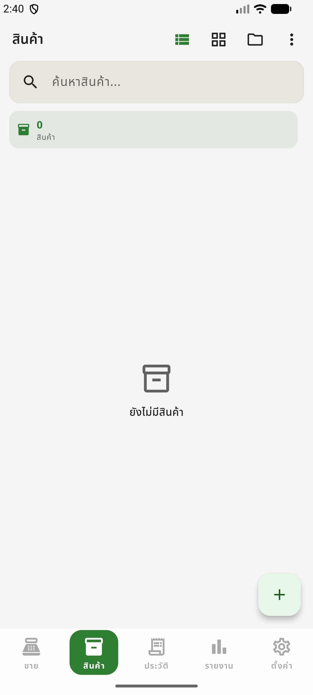
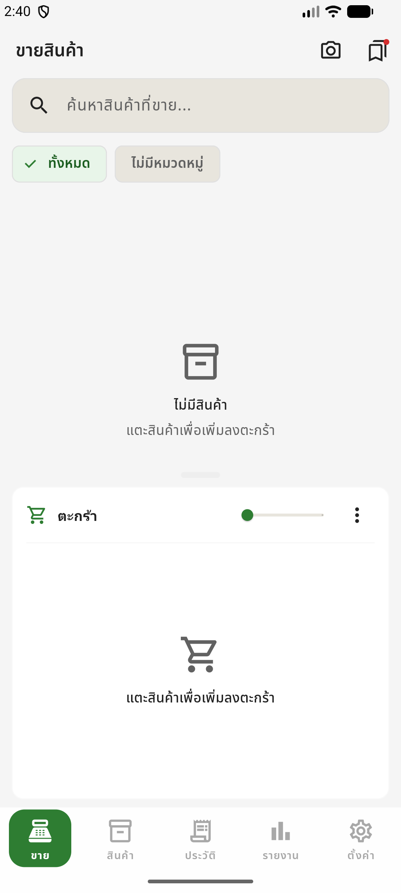
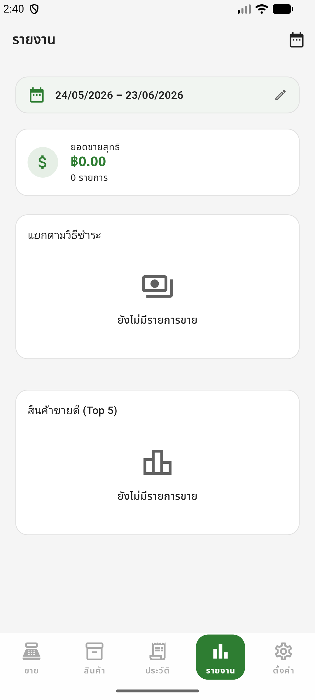
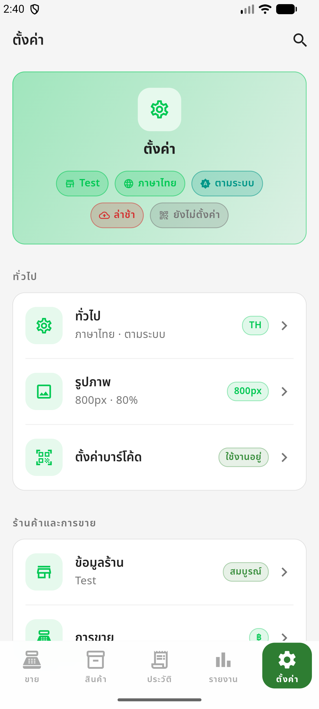

<div align="center">
 
<pre style="background:none;border:none;">
╔═══════════════════════════════════════════════════════════════╗
║                                                               ║
║   🛒  PROMSELL  —  Offline-first Mobile POS for Merchants    ║
║                                                               ║
╚═══════════════════════════════════════════════════════════════╝
</pre>
 
<h1>Promsell — POS Community Edition</h1>
 
<p>
  <strong>An offline-first mobile POS system built with Flutter for small businesses and local merchants.</strong>
</p>
 
<p>
  <a href="https://flutter.dev"></a>
  <a href="https://dart.dev"></a>
  <a href="https://github.com/teeprakorn1/promsell-pos-ce/blob/main/LICENSE"></a>
</p>
 
<p>
  <a href="https://github.com/teeprakorn1/promsell-pos-ce/actions/workflows/ci.yml"></a>
  <a href="https://codecov.io/gh/teeprakorn1/promsell-pos-ce"></a>
  <a href="https://github.com/teeprakorn1/promsell-pos-ce/commits/main"></a>
  <a href="https://github.com/teeprakorn1/promsell-pos-ce"></a>
  <a href="https://github.com/teeprakorn1/promsell-pos-ce/pulls"></a>
</p>
 
<table align="center">
  <tr>
    <td align="center"><b>5</b><br>📱 Tabs</td>
    <td align="center"><b>2</b><br>🌐 Languages</td>
    <td align="center"><b>3</b><br>🎨 Themes</td>
    <td align="center"><b>100%</b><br>📴 Offline</td>
    <td align="center"><b>SQLite</b><br>💾 Storage</td>
  </tr>
</table>
 
</div>
 
---
 
**Promsell POS Community Edition** is an open-source point-of-sale application designed for small shops, market stalls, and local merchants who need a fast, reliable, and offline-capable cash register on their phone or tablet. Built with Flutter and Drift SQLite, it works without an internet connection, supports Thai and English with live language switching, and provides full sales tracking, inventory management, and reporting.

> **Latest Release: v0.8.9** — Restaurant mode (order type/channel, table management, service charge); customer & promotion management with full CRUD; home dashboard redesign (hero card, stats row, promotion banner with gradient + floating animation); navbar floating center button with bounce animation; product modifiers/options; report/history merge. Test suite green: **1373 passing**, `flutter analyze` clean.

---

## Table of contents

- [Quick start](#quick-start)
- [Project structure](#project-structure)
- [Screenshots](#screenshots)
- [Documentation](#documentation)
- [Contributing](#contributing)
- [License](#license)

---

## Quick start

### Prerequisites

- Flutter SDK ≥ 3.11 ([install guide](https://docs.flutter.dev/get-started/install))
- Android Studio or Xcode for device/emulator
- Git

### Install and run

```bash
# 1. Clone
git clone https://github.com/teeprakorn1/promsell-pos-ce.git
cd promsell-pos-ce

# 2. Install dependencies
flutter pub get

# 3. Generate code (Drift, l10n)
flutter gen-l10n
dart run build_runner build

# 4. Run on connected device or emulator (dev flavor)
flutter run --flavor dev -t lib/main_dev.dart
```

### Build release APK

```bash
flutter build apk --release --flavor prod -t lib/main_prod.dart
```

The APK will be at `build/app/outputs/flutter-apk/app-prod-release.apk`.

For more details, see [`docs/USAGE.md`](docs/USAGE.md).

### Dev workflow

```
┌──────────────┐     ┌───────────────┐      ┌──────────────────────┐
│  Source Code │ ──▶ │  build_runner │ ──▶ │  Generated Code      │
│  (lib/)      │     │  (Drift + DI) │      │  *.g.dart            │
│              │     │               │      │  *.config.dart       │
└──────────────┘     └───────────────┘      └──────────┬───────────┘
                                                       │
                              ┌────────────────────────┘
                              ▼
                    ┌───────────────────┐      ┌───────────────────┐
                    │  flutter gen-l10n │      │  Flutter Compiler │
                    │  (ARB → Dart)     │ ──▶  │  (AOT / JIT)      │
                    └───────────────────┘      └────────┬──────────┘
                                                        │
                          ┌─────────────────────────────┘
                          ▼
               ┌─────────────────────┐
               │  Build Output       │
               │  APK / AAB / IPA    │
               └─────────────────────┘
```

---

## Project structure

```
promsell-pos-ce/
├── lib/
│   ├── core/
│   │   ├── database/          # Drift schema, tables, and migrations
│   │   ├── di/                # injectable + get_it DI
│   │   ├── extensions/        # context.l10n helper
│   │   ├── theme/             # AppColors, AppTheme, SettingsThemeExtension
│   │   ├── utils/             # IdGenerator, payment_method, etc.
│   │   └── widgets/           # shared UI primitives
│   ├── features/
│   │   ├── home/              # Home dashboard (hero card, stats, menu grid, promotion banner)
│   │   ├── sale/              # Cart + checkout (CartBloc, DraftBloc, CheckoutBloc)
│   │   ├── product/           # CRUD inventory, barcode + image generation, category, option groups
│   │   ├── customer/          # Customer CRUD (CustomerBloc, list/form pages)
│   │   ├── promotion/         # Promotion CRUD (PromotionBloc, percent/fixed discount)
│   │   ├── receipt/           # PDF receipt, labels, PromptPay QR
│   │   ├── report/            # Analytics dashboard + history sub-tab (merged)
│   │   ├── inventory/         # Inventory log viewer + stock adjust
│   │   └── settings/          # Theme, locale, shop info, business type, backup
│   ├── l10n/                  # ARB files (app_th.arb, app_en.arb) — 90+ keys
│   └── main.dart              # App entry + 5-tab shell (Home, Product, Sale, Report, Settings)
├── docs/
│   ├── ARCHITECTURE.md        # Architecture index → C4, deep-dive, ADRs
│   ├── DATABASE.md            # Database index → schema, queries, ops
│   ├── USAGE.md               # Usage index → features, development
│   ├── DEPLOY.md              # Build, signing, release checklist
│   ├── architecture/          # C4 diagrams, technical deep-dive, ADRs
│   ├── database/              # Schema reference, query patterns, migration & ops
│   ├── usage/                 # Features walkthrough, development reference
│   ├── codebase/              # Core modules, conventions, file deps, testing
│   ├── changelog/             # Archived changelogs (v0.1.x–v0.7.x)
│   └── readme/                # Features, roadmap, testing (split from README)
├── android/                   # Android platform code
├── ios/                       # iOS platform code
├── test/                      # 1373 tests (unit + widget + integration)
├── pubspec.yaml
├── l10n.yaml
├── CODEBASE.md                # System overview, architecture, links
├── CONTRIBUTING.md            # Contribution guide
├── CODE_OF_CONDUCT.md
├── SECURITY.md
├── CHANGELOG.md               # Current versions (v0.8.9) + archive links
├── LICENSE
└── README.md
```

### Architecture at a glance

```
┌─────────────────── MaterialApp ──────────────────────┐
│  BlocBuilder<SettingsCubit> (locale, theme, mode)    │
│                                                      │
│  ┌─── NavigationBar (5 tabs, lazy-loaded) ────────┐  │
│  │  Home    Product   Sale   Report   Settings    │  │
│  └────────────────────┬───────────────────────────┘  │
│                       │                              │
│    Overlay: Onboarding (6-step, first-launch)        │
└───────────────────────┼──────────────────────────────┘
                        ▼
┌───────────────────────────────────────────────────────────┐
│  Clean Architecture (per feature)                         │
│                                                           │
│  Presentation → Domain ← Data                             │
│  (Widgets+BLoC)  (Entities+UseCases)  (Repos+DAOs)        │
│                                                           │
│  Domain has zero external dependencies                    │
└───────────────────────────────────────────────────────────┘
```

Each feature follows **Clean Architecture**:

```
features/<name>/
├── data/
│   ├── datasources/      # Drift DAO wrappers
│   └── repositories/     # Repository implementations
├── domain/
│   ├── entities/         # Pure Dart models
│   ├── repositories/     # Abstract interfaces
│   └── usecases/         # Business logic
└── presentation/
    ├── bloc/ or cubit/   # State management
    ├── pages/            # Page-level UI
    └── widgets/          # Subfoldered by domain
        ├── <domain>/     #   MANDATORY — e.g. cart/, checkout/, forms/
        │   ├── <widget>/ #   OPTIONAL — extracted subcomponents for large widgets (>300 lines)
        │   └── <widget>.dart  # Main widget, composes subcomponents
        ├── shared/       #   OPTIONAL — cross-domain reuse (2+ importers)
        └── deprecated/   #   OPTIONAL — backward-compat aliases only
```

---

## Screenshots

> Screenshots captured via `adb screencap` on Android emulator (dev flavor).

| Home | Products | Sale | Report | Settings |
|------|----------|------|--------|----------|
|  |  |  |  |  |

---

## Documentation

### Project docs

| Document | Contents |
|----------|----------|
| [`CODEBASE.md`](CODEBASE.md) | System overview, architecture diagrams, layer structure, UI notes, links to core modules, conventions, file deps, testing |
| [`docs/ARCHITECTURE.md`](docs/ARCHITECTURE.md) | Architecture index → C4 diagrams, technical deep-dive, ADRs (001-024) |
| [`docs/DATABASE.md`](docs/DATABASE.md) | Database index → overview, ERD, sync columns → schema, queries, migration & ops |
| [`docs/USAGE.md`](docs/USAGE.md) | Usage index → install, build, run → features, development reference |
| [`docs/DEPLOY.md`](docs/DEPLOY.md) | Build, signing, release checklist, smoke test |
| [`docs/PRIVACY_POLICY.md`](docs/PRIVACY_POLICY.md) | Privacy policy template for Play Store / App Store |
| [`docs/STORE_SUBMISSION.md`](docs/STORE_SUBMISSION.md) | Store submission checklist: keystore, screenshots, build commands, console setup |
| [`CHANGELOG.md`](CHANGELOG.md) | Current version history (v0.8.9) + archive links to older versions |
| [`docs/changelog/`](docs/changelog/) | Archived changelogs by minor version (v0.1.x–v0.7.x) |

### Split references

| Document | Contents |
|----------|----------|
| [`docs/readme/features.md`](docs/readme/features.md) | Full features table (22 features) + tech stack (12 layers) |
| [`docs/readme/roadmap.md`](docs/readme/roadmap.md) | Phase 1 milestones (R3–R17) + future plans + release timeline |
| [`docs/readme/testing.md`](docs/readme/testing.md) | 1373 tests across 9 layers + test pyramid + run commands |

---

## Contributing

Contributions are welcome — bug reports, feature suggestions, or pull requests.

Read **[CONTRIBUTING.md](CONTRIBUTING.md)** for the full guide: branch naming, commit conventions, code style, and testing requirements.

For security vulnerabilities, see **[SECURITY.md](SECURITY.md)** — do not file public issues.

---

## License

Licensed under the **GNU Affero General Public License v3.0** — see [`LICENSE`](LICENSE) for details.

```
Copyright (C) 2026 MN Lizard Team

This program is free software: you can redistribute it and/or modify
it under the terms of the GNU Affero General Public License as published
by the Free Software Foundation, either version 3 of the License, or
(at your option) any later version.
```

---

<div align="center">

Built by **[MN Lizard Team](https://github.com/MN-Lizard-Team)**

**Creator & Core Maintainer:**
[@teeprakorn1](https://github.com/teeprakorn1)

**Contributors:**
[@FrameHandsomez](https://github.com/FrameHandsomez)

<sub>Promsell POS Community Edition · v0.8.9 · AGPL-3.0</sub>

</div>
