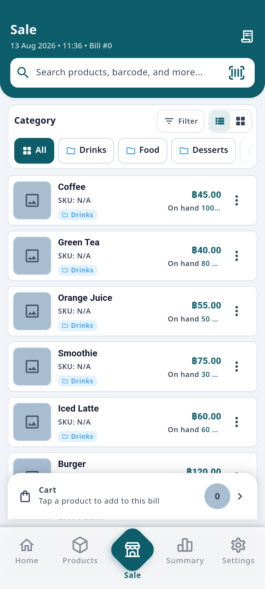
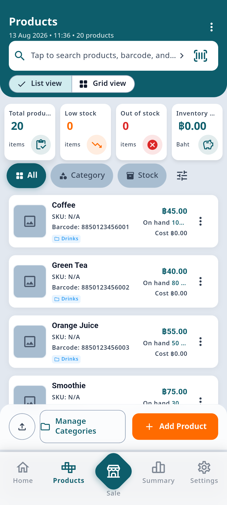
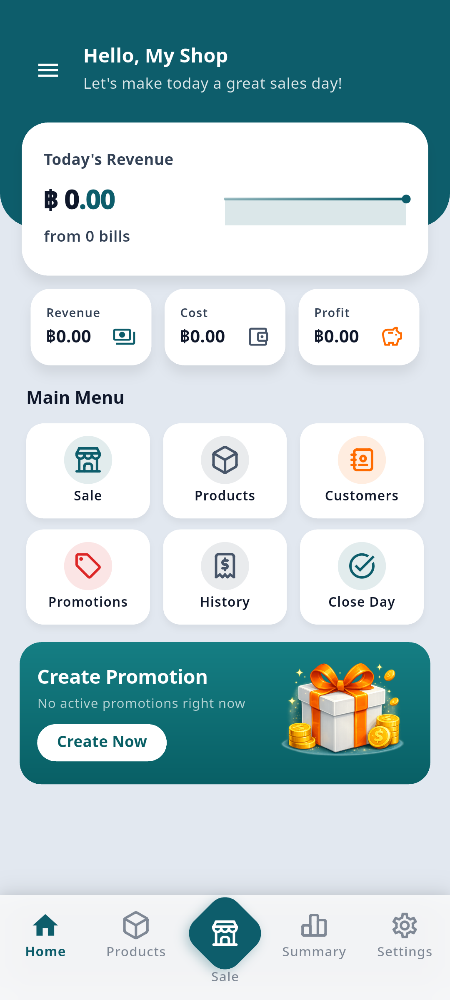
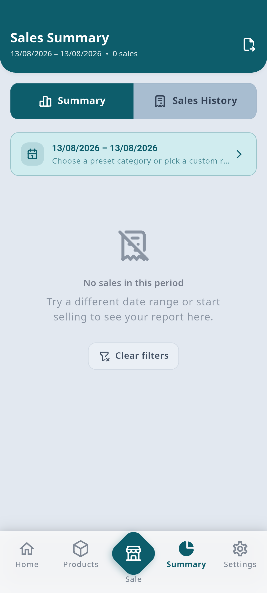
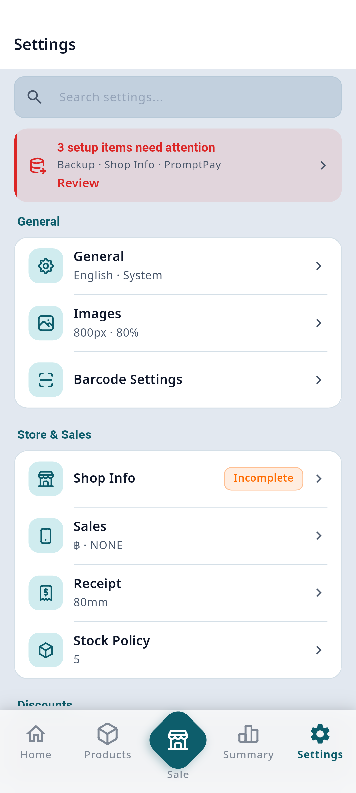

# Promsell

Offline POS for one device. Community Edition.

A cash register that lives on the phone: sell, park bills, count stock, close the day. No cloud. No multi-shop sync. Thai and English.

[](https://github.com/teeprakorn1/promsell-pos-ce/actions/workflows/ci.yml)
[](docs/testing/CI.md)
[](LICENSE)
[](https://github.com/teeprakorn1/promsell-pos-ce/releases/tag/v0.9.3)
[](https://github.com/teeprakorn1/promsell-pos-ce/releases)
[](https://github.com/teeprakorn1/promsell-pos-ce/commits/main)

[](https://flutter.dev)
[](https://dart.dev)
[](docs/DATABASE.md)
[](docs/DATABASE.md)
[](#status)
[](lib/l10n)
[](docs/DEPLOY.md)
[](docs/STORE_SUBMISSION.md)
[](https://github.com/teeprakorn1/promsell-pos-ce/issues)
[](https://github.com/teeprakorn1/promsell-pos-ce/stargazers)

[Status](#status) · [Overview](#overview) · [What it does](#what-it-does) · [Screenshots](#screenshots) · [Requirements](#requirements) · [Quick start](#quick-start) · [Security](#security-and-data) · [Stack](#stack) · [Docs](#documentation) · [Contributing](#contributing) · [Authors](#authors) · [License](#license)

---

## Status

**`0.9.3`** · latest GitHub tag **v0.9.3** · schema **v32** · **not on Play production**.

A green CI badge means host tests and analyze passed. It does not mean the app is store-ready, that device E2E is green, or that you should put a shop's month of sales on it without reading the limits below.

> **Unreleased work (in `[Unreleased]` of CHANGELOG.md, not yet tagged):** P0 scaling foundation (cursor-paginated queries, DB-backed product search, SQL report aggregate, bounded streaming CSV export, new cursor indexes, 10 performance regression tests) and P1 database lifecycle (migration safety preflight, WAL checkpoint service, database health service, backup export with SHA-256 checksums, AES-256-GCM recovery kit with PBKDF2 [code complete, device validation pending], 47 new tests). All P0/P1 benchmark numbers are **desktop fixture only** — on-device Android validation is a P2 prerequisite before claiming any SLO as met. See [ce-scaling-management-plan.md](docs/plan/COMPLETE/POST-090-MANAGE/ce-scaling-management-plan.md) and [p0-scaling-foundation.md](docs/plan/COMPLETE/POST-090-MANAGE/p0-scaling-foundation.md).

| | |
|---|---|
| For | Owner-operated stall or small shop, one device, cash + PromptPay |
| Not for | Staffed shifts with separate cashiers, tax invoices / e-Tax, several devices, cloud backup |
| Day-one limits | New installs require a **store PIN**. A backup restores on **this device only**. Uninstall without a `.enc` export = the database is gone. |

Play / signing checklist: [docs/STORE_SUBMISSION.md](docs/STORE_SUBMISSION.md). What changed: [CHANGELOG.md](CHANGELOG.md).

---

## Overview

End-to-end on **one device**. Nothing in this picture is a Promsell server.

```
 Merchant (one phone / tablet)
 PIN · Thai / English
         |
         v
 +---------------------------+
 |  Flutter app  (dev/prod)  |
 |  Home  Product  Sale      |
 |  Report         Settings  |
 +-------------+-------------+
               |
    presentation  ->  domain  <-  data
               |         |
               |         v
               |  Money / payable
               |  CreateSale
               |  VoidSale (PIN)
               |         |
               +----+----+
                    |
                    v
         +----------------------+
         | SQLCipher  schema v32|
         | key = Keystore /     |
         |         Keychain     |
         +----------+-----------+
                    |
     +--------------+--------------+
     |              |              |
     v              v              v
 PDF / share   .enc backup    product image
 (OS sheet)    this device    URL (optional
               only           internet)
     |
     x  no Promsell cloud
     x  no multi-device sync
```

Layers and ADRs: [docs/ARCHITECTURE.md](docs/ARCHITECTURE.md). Schema: [docs/DATABASE.md](docs/DATABASE.md).

---

## What it does

- **Sell** — catalog + cart, line and cart discounts, VAT `NONE` / `INCLUSIVE` / `EXCLUSIVE`, split tender, PromptPay QR (offline EMVCo). The payable total is computed in domain code, not trusted from the UI.
- **Park bills** — save and reopen drafts (multi-bill).
- **Catalog** — products, categories, barcode camera / HID wedge, SKU, optional modifiers.
- **Stock** — on-hand qty, adjust sheet with PIN, inventory log. Sales deduct inside the same database transaction as the receipt.
- **Day close** — expected vs counted cash, multi-tender breakdown, optional lock so you cannot sell after close.
- **Reports** — net revenue, voids, tenders, profit/margin when cost is set; export PDF / CSV on device.
- **Backup** — encrypted `.enc` export (AES-GCM, PIN). Restore is **same device only** (SQLCipher key stays in this phone’s secure storage). Recovery kit (`.promkey`, AES-256-GCM + PBKDF2) is implemented but **unreleased** — cross-device restore device smoke is still pending.
- **Restaurant extras** — tables, dine-in / takeaway, service charge (optional mode).

Not included: thermal Bluetooth printer, partial refunds, staff roles, cross-device restore device smoke, a sync engine. Those are documented as later / out of CE, not missing by accident.

Longer lists: [docs/readme/features.md](docs/readme/features.md) (index) · [docs/usage/features.md](docs/usage/features.md) (cashier walkthrough).

---

## Screenshots

<p align="center">
  
  
  
</p>
<p align="center">
  
  
</p>

Thai-language screenshots: [screenshots/store/th/](screenshots/store/th/).

---

## Requirements

- Flutter SDK ≥ 3.11 and a device or emulator (Android is the supported store track; iOS builds exist but are a separate cut)
- `flutter pub get`, then code generation (Drift / injectable / l10n) before the first run
- Bare `flutter run` is **not** supported — flavors `dev` / `prod` are required

---

## Quick start

```bash
git clone https://github.com/teeprakorn1/promsell-pos-ce.git
cd promsell-pos-ce
flutter pub get
flutter gen-l10n
dart run build_runner build --delete-conflicting-outputs
flutter run --flavor dev -t lib/main_dev.dart
```

Do not stage `*.g.dart` or `*.config.dart`. `lib/l10n/app_localizations*.dart` are still tracked — commit them if `gen-l10n` changed them.

First launch runs onboarding and asks you to create a store PIN.

| Next | Where |
|------|--------|
| Merchant backup / PIN / flavors | [docs/USAGE.md](docs/USAGE.md) |
| Signed APK / AAB | [docs/DEPLOY.md](docs/DEPLOY.md) |
| What CI actually runs | [docs/testing/CI.md](docs/testing/CI.md) |
| Open a PR | [CONTRIBUTING.md](CONTRIBUTING.md) |

---

## Security and data

This is a **local** app. Promsell does not run a backend for your sales.

- The live database is **SQLCipher** (AES-256). The key is in Android Keystore / iOS Keychain. That protects the file at rest. It does not lock the OS screen and it is not staff RBAC.
- **Store PIN** (PBKDF2) is required on new installs. It gates void, backup, AdjustStock, and CSV import. Product-form / quick-edit price and stock are **not** fully PIN-gated yet.
- No developer analytics or cloud. Customer names, phones, and PromptPay IDs stay on the device unless **you** share a backup file.
- `INTERNET` is optional and only used to load product image URLs you type in.
- Receipts are **sales receipts**. They are not Thai tax invoices, even if a Tax ID is printed.

Vulnerabilities: [SECURITY.md](SECURITY.md) (private report, not a public issue). Privacy: [docs/PRIVACY_POLICY.md](docs/PRIVACY_POLICY.md).

---

## Stack

| Layer | Choice |
|-------|--------|
| UI | Flutter, Material 3, BLoC / Cubit |
| Data | Drift (SQLite) + SQLCipher, schema v32 |
| Money | Satang `Money` in memory; INTEGER `*_satang` + REAL baht dual-write on disk (Phase M, schema v32) |
| Scaling | Cursor-paginated queries, DB-backed search, SQL report aggregate, bounded CSV export (P0, unreleased) |
| DB lifecycle | Migration safety preflight, WAL checkpoint, health service, backup checksums, recovery kit (P1, unreleased) |
| DI | injectable + get_it |
| License | AGPL-3.0 |

Folder map and conventions: [CODEBASE.md](CODEBASE.md). Architecture and ADRs 001–028: [docs/ARCHITECTURE.md](docs/ARCHITECTURE.md). Schema: [docs/DATABASE.md](docs/DATABASE.md).

---

## Documentation

Start here, then go deeper. Do not treat archived plans as a current queue.

### Product and store

| Doc | Use it for |
|-----|------------|
| [docs/USAGE.md](docs/USAGE.md) | Install, flavors, PIN, same-device backup |
| [docs/usage/features.md](docs/usage/features.md) | Cashier walkthrough |
| [docs/readme/features.md](docs/readme/features.md) | Capability index |
| [docs/PRIVACY_POLICY.md](docs/PRIVACY_POLICY.md) | What stays on the device |
| [docs/STORE_SUBMISSION.md](docs/STORE_SUBMISSION.md) | Play checklist — production still gated |
| [docs/DEPLOY.md](docs/DEPLOY.md) | Signed APK / AAB, keystore |
| [CHANGELOG.md](CHANGELOG.md) | 0.9.3 release notes + history (latest tag v0.9.3) |

### Engineering

| Doc | Use it for |
|-----|------------|
| [CODEBASE.md](CODEBASE.md) | Repo map, layers, conventions |
| [docs/ARCHITECTURE.md](docs/ARCHITECTURE.md) | C4, ADRs 001–028 |
| [docs/architecture/c4-diagrams.md](docs/architecture/c4-diagrams.md) | Context / container / component |
| [docs/DATABASE.md](docs/DATABASE.md) | Schema v32, SQLCipher, sync **metadata** (not a sync engine) |
| [docs/database/schema-reference.md](docs/database/schema-reference.md) | Tables and indexes |
| [docs/database/migration-and-ops.md](docs/database/migration-and-ops.md) | Upgrades — SSOT is `app_database_migrations.dart` (extension `AppDatabaseMigrationLogic`) |
| [SECURITY.md](SECURITY.md) | PIN scope, backup limits, private vuln reports |
| [CONTRIBUTING.md](CONTRIBUTING.md) | Branch, commits, PR test commands |

### Quality and plans

| Doc | Use it for |
|-----|------------|
| [docs/testing/CI.md](docs/testing/CI.md) | What GitHub Actions actually runs |
| [docs/codebase/testing.md](docs/codebase/testing.md) | Host vs device tests |
| [docs/testing/RELEASE_1.0_SMOKE.md](docs/testing/RELEASE_1.0_SMOKE.md) | 1.0 smoke — still **No-Go** |
| [docs/plan/index.md](docs/plan/index.md) | Plan map |
| [V092-INTEGRITY](docs/plan/UN-COMPLETE/V092-INTEGRITY/OVERVIEW.md) | `v0.9.2` integrity cut (tagged) |
| [ARCH-HARDEN-1.0](docs/plan/UN-COMPLETE/ARCH-HARDEN-1.0/OVERVIEW.md) | Architecture before Play (paused until V092-GATE) |
| [POST-090-MANAGE](docs/plan/COMPLETE/POST-090-MANAGE/POST-090-OVERVIEW.md) | Store / Phase M / key restore after AH-GATE-1 |
| [CE scaling management plan](docs/plan/COMPLETE/POST-090-MANAGE/ce-scaling-management-plan.md) | P0 scaling + P1 database lifecycle roadmap (unreleased) |
| [P0 scaling foundation](docs/plan/COMPLETE/POST-090-MANAGE/p0-scaling-foundation.md) | Cursor pagination, DB search, bounded CSV, performance tests (unreleased) |
| [DOC-SSOT](docs/plan/UN-COMPLETE/DOC-SSOT/OVERVIEW.md) | Docs honesty |

---

## Contributing

Bug reports and focused PRs are welcome. [CONTRIBUTING.md](CONTRIBUTING.md) has branch names, commit style, and the test commands that match CI.

Please do not send drive-by PRs for multi-shop sync, cloud backup, or “make it a tax invoice.” Those are explicit non-goals for this edition until the plans say otherwise.

Security issues: [SECURITY.md](SECURITY.md), not the public tracker.

---

## Authors

Promsell is built by **[MN Lizard Team](https://github.com/MN-Lizard-Team)**.

| | |
|---|---|
| Creator and maintainer | [teeprakorn1](https://github.com/teeprakorn1) |
| Contributor | [FrameHandsomez](https://github.com/FrameHandsomez) |

Issues and PRs should go to this repository. For private security mail, see [SECURITY.md](SECURITY.md).

---

## License

[GNU Affero General Public License v3.0](LICENSE). If you modify the software and let others use it over a network, you must offer the corresponding source.

<sub>Promsell POS CE · MN Lizard Team · [teeprakorn1](https://github.com/teeprakorn1) · v0.9.3 · latest tag v0.9.3 · AGPL-3.0</sub>
