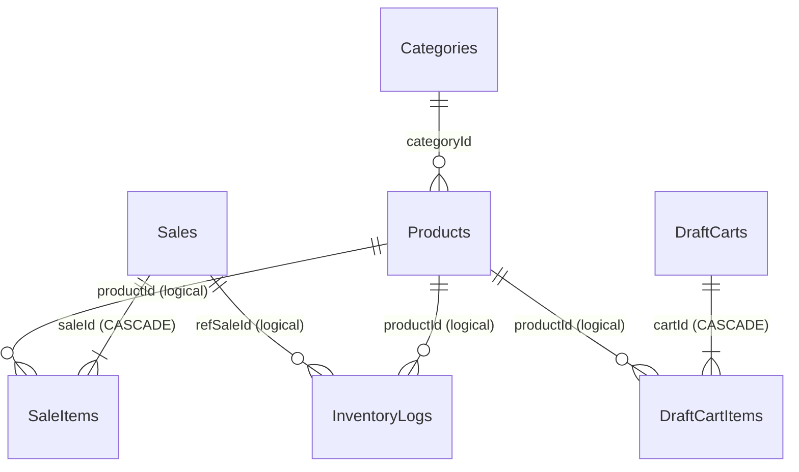

# Database Handbook — Promsell POS CE v0.8.5

Complete reference for the Promsell database: schema, relationships, indexes, migration, query patterns, backup, and performance.

---

## Overview

| Property | Value |
|----------|-------|
| **Engine** | SQLite via [Drift](https://drift.simonbinder.eu/) (type-safe ORM) |
| **File** | `promsell_pos.db` (platform default app directory) |
| **Schema version** | 17 |
| **Tables** | 9 |
| **ID strategy** | UUIDv4 TEXT on all tables (`IdGenerator.newId()`) |
| **Journal mode** | WAL (`PRAGMA journal_mode=WAL`) |
| **Foreign keys** | Enabled (`PRAGMA foreign_keys=ON`) |
| **Code location** | `lib/core/database/` |
| **Generated file** | `app_database.g.dart` — **do not edit** (not committed to git; run `build_runner build` to generate) |

---

## Entity-Relationship Diagram



### Table groupings

```
┌──────────────────────────────────────────────────────────────────────────────┐
│  Transactional (FK-enforced CASCADE)                                         │
│  ┌──────────┐   1:N  ┌─────────────┐    1:N  ┌────────────────┐              │
│  │  Sales   │ ──────▶│  SaleItems  │ ◀──────│   Products     │              │
│  └────┬─────┘        └─────────────┘         └───────┬────────┘              │
│       │ logical                               logical│                       │
│       ▼                                              ▼                       │
│  ┌──────────────┐                            ┌────────────────┐              │
│  │ InventoryLogs│                            │  Categories    │              │
│  └──────────────┘                            └────────────────┘              │
└──────────────────────────────────────────────────────────────────────────────┘

┌──────────────────────────────────────────────────────────────────────────────┐
│  Draft (FK-enforced CASCADE)                                                 │
│  ┌────────────┐   1:N  ┌────────────────┐                                    │
│  │ DraftCarts │ ──────▶│ DraftCartItems │ ◀── logical ── Products           │
│  └────────────┘        └────────────────┘                                    │
└──────────────────────────────────────────────────────────────────────────────┘

┌──────────────────────────────────────────────────────────────────────────────┐
│  Key-Value (no FK)                                                           │
│  ┌──────────────┐  1:1   ┌────────────────┐                                  │
│  │  AppSettings │        │  DailyCloses   │                                  │
│  └──────────────┘        └────────────────┘                                  │
└──────────────────────────────────────────────────────────────────────────────┘
```

### Relationship notes

| Relationship | FK enforced? | Why |
|-------------|-------------|-----|
| `sale_items.saleId → sales.id` | **Yes** (CASCADE) | Deleting a sale must cascade to its items |
| `draft_cart_items.cartId → draft_carts.id` | **Yes** (CASCADE) | Deleting a draft must cascade to its items |
| `sale_items.productId → products.id` | **No** (logical) | Sale history must survive product deletion |
| `inventory_logs.productId → products.id` | **No** (logical) | Audit trail must survive product deletion |
| `inventory_logs.refSaleId → sales.id` | **No** (logical) | Log must survive even if sale is hard-deleted |
| `products.categoryId → categories.id` | **No** (logical) | Product must survive category deletion |

> Full ERD with all columns: [`docs/database/schema-reference.md`](database/schema-reference.md)

---

## Sync-Ready Columns

These columns exist on all tables and are **actively populated** since schema v11 (v0.7.0) for Phase 4 (multi-device sync) readiness. `deviceId` was backfilled on all existing rows in schema v13.

| Column | Type | Purpose |
|--------|------|---------|
| `version` | INTEGER (default 1) | Optimistic concurrency — increment on each update |
| `deviceId` | TEXT (nullable) | Identifies which device created/modified the row |
| `updatedAt` | DATETIME | Last modification timestamp for conflict resolution |
| `deletedAt` | DATETIME (nullable) | **Soft delete** — row is hidden but not physically removed |

### Soft delete pattern

When a record is "deleted":
1. Set `deletedAt = DateTime.now()` instead of `DELETE FROM`
2. All queries filter `WHERE deleted_at IS NULL` (or use `isActive` for products)
3. Sync can detect deletions by comparing `deletedAt` timestamps

> Products use `isActive` for soft deactivation in the UI layer. The `deletedAt` column enables true soft-delete + sync in Phase 4.

### Sync column flow

```
              Local Write (insert/update/delete)
                              │
                              ▼
              ┌───────────────────────────────┐
              │  version++                    │
              │  updatedAt = now()            │
              │  deviceId = this.device       │
              │  deletedAt = now()? (soft)    │
              └───────────────┬───────────────┘
                              │
                              ▼
              ┌───────────────────────────────┐
              │  Local SQLite (WAL)           │
              │  9 tables, all sync-ready     │
              └───────────────┬───────────────┘
                              │
             Phase 4 (future) │
              ┌───────────────▼───────────────┐
              │  Sync Engine                  │
              │  Compare version + updatedAt  │
              │  Resolve conflicts (last-WW)  │
              │  Merge deletedAt flags        │
              └───────────────────────────────┘
```

---

## Migration timeline

```
v1          v2          v5          v7          v8          v10
│           │           │           │           │           │
▼           ▼           ▼           ▼           ▼           ▼
Initial     Draft      Image       VAT         Daily       Device
schema      discounts  settings    columns     Closes      settings

v11         v12         v13         v14         v15         v16    v17
│           │           │           │           │           │      │
▼           ▼           ▼           ▼           ▼           ▼      ▼
Sync        Timestamp   Backfill    Category    Category    Unique  Auto-
columns     INT ms      deviceId    FK + UUID   color/icon  barcode dedup
(6 tables)  conversion  (all rows)  backfill    presets     index   barcodes
```

---

## Reference documents

| Document | Content |
|----------|---------|
| [`docs/database/schema-reference.md`](database/schema-reference.md) | All 9 tables with column details, indexes, seed data, enum values |
| [`docs/database/query-patterns.md`](database/query-patterns.md) | Drift query patterns: watch products, insert sale, void sale, date range, draft upsert |
| [`docs/database/migration-and-ops.md`](database/migration-and-ops.md) | Migration guide (v2→v17), backup & restore, encrypted backups, performance notes, DB testing |

---

<sub>Promsell POS CE · v0.8.5 · Schema v17 · 9 tables · UUIDv4</sub>