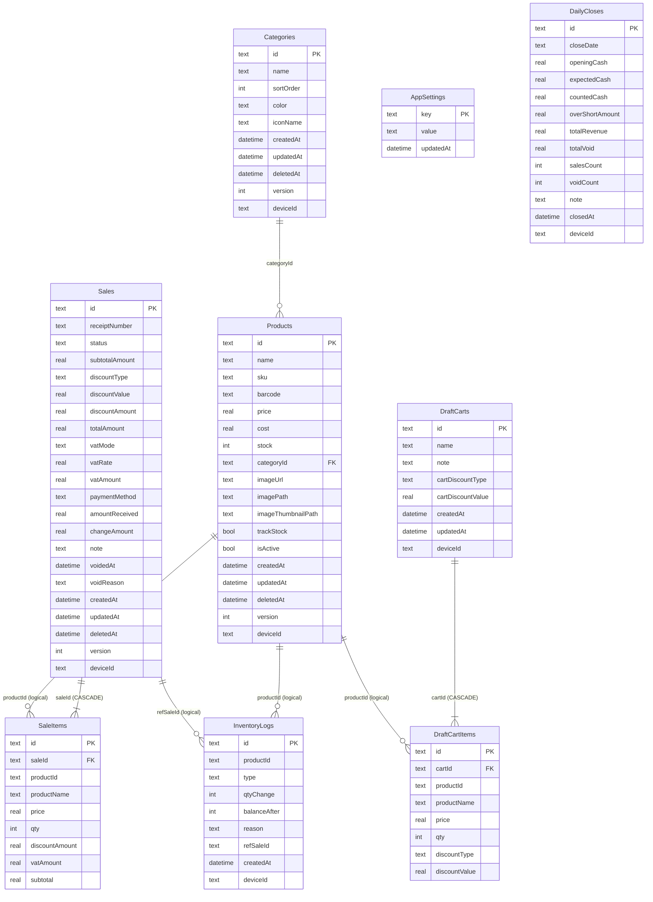

# Database Handbook — Promsell POS CE v0.7.6

Complete reference for the Promsell database: schema, relationships, indexes, migration, query patterns, backup, and performance.

---

## Table of contents

- [Overview](#overview)
- [Entity-Relationship Diagram](#entity-relationship-diagram)
- [Schema Reference](#schema-reference)
- [Indexes](#indexes)
- [Seed Data](#seed-data)
- [Sync-Ready Columns](#sync-ready-columns)
- [Enum & Constant Values](#enum--constant-values)
- [Query Patterns](#query-patterns)
- [Migration Guide](#migration-guide)
- [Backup & Restore](#backup--restore)
- [Performance Notes](#performance-notes)
- [Testing](#testing)

---

## Overview

| Property | Value |
|----------|-------|
| **Engine** | SQLite via [Drift](https://drift.simonbinder.eu/) (type-safe ORM) |
| **File** | `promsell_pos.db` (platform default app directory) |
| **Schema version** | 15 |
| **Tables** | 9 |
| **ID strategy** | UUIDv4 TEXT on all tables (`IdGenerator.newId()`) |
| **Journal mode** | WAL (`PRAGMA journal_mode=WAL`) |
| **Foreign keys** | Enabled (`PRAGMA foreign_keys=ON`) |
| **Code location** | `lib/core/database/` |
| **Generated file** | `app_database.g.dart` — **do not edit** |

---

## Entity-Relationship Diagram



### Relationship notes

| Relationship | FK enforced? | Why |
|-------------|-------------|-----|
| `sale_items.saleId → sales.id` | **Yes** (CASCADE) | Deleting a sale must cascade to its items |
| `draft_cart_items.cartId → draft_carts.id` | **Yes** (CASCADE) | Deleting a draft must cascade to its items |
| `sale_items.productId → products.id` | **No** (logical) | Sale history must survive product deletion |
| `inventory_logs.productId → products.id` | **No** (logical) | Audit trail must survive product deletion |
| `inventory_logs.refSaleId → sales.id` | **No** (logical) | Log must survive even if sale is hard-deleted |
| `products.categoryId → categories.id` | **No** (logical) | Product must survive category deletion |

---

## Schema Reference

### Products

Source: `lib/core/database/tables/products_table.dart`

| Column | Type | Nullable | Default | Constraint |
|--------|------|----------|---------|------------|
| `id` | TEXT | No | — | **PK**, UUIDv4 |
| `name` | TEXT | No | — | length 1–200 |
| `sku` | TEXT | Yes | — | |
| `barcode` | TEXT | Yes | — | |
| `price` | REAL | No | — | |
| `cost` | REAL | Yes | — | |
| `stock` | INTEGER | No | `0` | |
| `categoryId` | TEXT | Yes | — | Logical ref → categories |
| `imageUrl` | TEXT | Yes | — | Network URL for future online sync |
| `imagePath` | TEXT | Yes | — | Local file path from gallery/camera pick |
| `imageThumbnailPath` | TEXT | Yes | — | Local thumbnail path (200px) for small avatar display |
| `trackStock` | BOOLEAN | No | `true` | `false` = service item: skip stock check, no deduction, show ∞ in UI |
| `isActive` | BOOLEAN | No | `true` | |
| `createdAt` | DATETIME | No | `currentDateAndTime` | |
| `updatedAt` | DATETIME | No | `currentDateAndTime` | |
| `deletedAt` | DATETIME | Yes | — | Soft delete |
| `version` | INTEGER | No | `1` | Sync |
| `deviceId` | TEXT | Yes | — | Sync |

### Sales

Source: `lib/core/database/tables/sales_table.dart`

| Column | Type | Nullable | Default | Constraint |
|--------|------|----------|---------|------------|
| `id` | TEXT | No | — | **PK**, UUIDv4 |
| `receiptNumber` | TEXT | Yes | — | |
| `status` | TEXT | No | `'COMPLETED'` | `COMPLETED` \| `VOIDED` |
| `subtotalAmount` | REAL | No | `0` | |
| `discountType` | TEXT | Yes | — | `PERCENT` \| `AMOUNT` |
| `discountValue` | REAL | Yes | — | |
| `discountAmount` | REAL | No | `0` | |
| `totalAmount` | REAL | No | — | |
| `vatMode` | TEXT | No | `'NONE'` | `NONE` \| `INCLUSIVE` \| `EXCLUSIVE` |
| `vatRate` | REAL | No | `0` | |
| `vatAmount` | REAL | No | `0` | |
| `paymentMethod` | TEXT | No | — | `cash` \| `transfer` \| `card` \| `promptpay` |
| `amountReceived` | REAL | Yes | — | |
| `changeAmount` | REAL | Yes | — | |
| `paymentReference` | TEXT | Yes | — | PromptPay transaction ID |
| `sendingBankCode` | TEXT | Yes | — | Bank code from slip verification |
| `note` | TEXT | Yes | — | |
| `voidedAt` | DATETIME | Yes | — | |
| `voidReason` | TEXT | Yes | — | |
| `createdAt` | DATETIME | No | `currentDateAndTime` | |
| `updatedAt` | DATETIME | No | `currentDateAndTime` | |
| `deletedAt` | DATETIME | Yes | — | Soft delete |
| `version` | INTEGER | No | `1` | Sync |
| `deviceId` | TEXT | Yes | — | Sync |

### SaleItems

Source: `lib/core/database/tables/sale_items_table.dart`

| Column | Type | Nullable | Default | Constraint |
|--------|------|----------|---------|------------|
| `id` | TEXT | No | — | **PK**, UUIDv4 |
| `saleId` | TEXT | No | — | **FK → sales.id** (CASCADE) |
| `productId` | TEXT | No | — | Logical ref → products (no FK) |
| `productName` | TEXT | No | — | Snapshot at time of sale |
| `price` | REAL | No | — | Snapshot at time of sale |
| `qty` | INTEGER | No | — | |
| `discountAmount` | REAL | No | `0` | |
| `vatAmount` | REAL | No | `0` | |
| `subtotal` | REAL | No | — | `price × qty − discount` |

> **Design decision:** `productId` has no FK constraint to `products` — sale history must survive product deletion. `productName` and `price` are snapshots.

### Categories

Source: `lib/core/database/tables/categories_table.dart`

| Column | Type | Nullable | Default | Constraint |
|--------|------|----------|---------|------------|
| `id` | TEXT | No | — | **PK**, UUIDv4 |
| `name` | TEXT | No | — | length 1–100 |
| `sortOrder` | INTEGER | No | `0` | |
| `color` | TEXT | Yes | — | Hex color (e.g. "E53935") |
| `iconName` | TEXT | Yes | — | Material icon identifier |
| `createdAt` | DATETIME | No | `currentDateAndTime` | |
| `updatedAt` | DATETIME | No | `currentDateAndTime` | |
| `deletedAt` | DATETIME | Yes | — | Soft delete |
| `version` | INTEGER | No | `1` | Sync |
| `deviceId` | TEXT | Yes | — | Sync |

### InventoryLogs

Source: `lib/core/database/tables/inventory_logs_table.dart`

| Column | Type | Nullable | Default | Constraint |
|--------|------|----------|---------|------------|
| `id` | TEXT | No | — | **PK**, UUIDv4 |
| `productId` | TEXT | No | — | Logical ref → products |
| `type` | TEXT | No | — | See [Enum Values](#enum--constant-values) |
| `qtyChange` | INTEGER | No | — | Signed: negative for sale, positive for void/adjustment |
| `balanceAfter` | INTEGER | No | — | Stock balance after this change |
| `reason` | TEXT | Yes | — | Free-text reason for adjustments |
| `refSaleId` | TEXT | Yes | — | Logical ref → sales (for SALE/VOID_REVERSAL) |
| `createdAt` | DATETIME | No | `currentDateAndTime` | |
| `deviceId` | TEXT | Yes | — | Sync |

### AppSettings

Source: `lib/core/database/tables/app_settings_table.dart`

| Column | Type | Nullable | Default | Constraint |
|--------|------|----------|---------|------------|
| `key` | TEXT | No | — | **PK** |
| `value` | TEXT | No | — | JSON-encoded string |
| `updatedAt` | DATETIME | No | `currentDateAndTime` | |

> Table name override: `app_settings` (Drift `tableName` getter).

### DraftCarts

Source: `lib/core/database/tables/draft_carts_table.dart`

| Column | Type | Nullable | Default | Constraint |
|--------|------|----------|---------|------------|
| `id` | TEXT | No | — | **PK**, UUIDv4 |
| `name` | TEXT | Yes | — | e.g. "Customer A", "Table 3" |
| `note` | TEXT | Yes | — | |
| `cartDiscountType` | TEXT | Yes | — | `PERCENT` \| `AMOUNT` |
| `cartDiscountValue` | REAL | Yes | — | |
| `createdAt` | DATETIME | No | `currentDateAndTime` | |
| `updatedAt` | DATETIME | No | `currentDateAndTime` | |
| `deviceId` | TEXT | Yes | — | Sync |

### DraftCartItems

Source: `lib/core/database/tables/draft_cart_items_table.dart`

| Column | Type | Nullable | Default | Constraint |
|--------|------|----------|---------|------------|
| `id` | TEXT | No | — | **PK**, UUIDv4 |
| `cartId` | TEXT | No | — | **FK → draft_carts.id** (CASCADE) |
| `productId` | TEXT | No | — | Logical ref → products |
| `productName` | TEXT | No | — | Snapshot |
| `price` | REAL | No | — | Snapshot |
| `qty` | INTEGER | No | — | |
| `discountType` | TEXT | Yes | — | `PERCENT` \| `AMOUNT` |
| `discountValue` | REAL | Yes | — | |

### DailyCloses

Source: `lib/core/database/tables/daily_closes_table.dart`

| Column | Type | Nullable | Default | Constraint |
|--------|------|----------|---------|------------|
| `id` | TEXT | No | — | **PK**, UUIDv4 |
| `closeDate` | TEXT | No | — | Format: `YYYY-MM-DD` |
| `openingCash` | REAL | No | `0` | |
| `expectedCash` | REAL | No | `0` | Calculated from sales |
| `countedCash` | REAL | No | `0` | Cashier input |
| `overShortAmount` | REAL | No | `0` | `countedCash − expectedCash` |
| `totalRevenue` | REAL | No | `0` | |
| `totalVoid` | REAL | No | `0` | |
| `salesCount` | INTEGER | No | `0` | |
| `voidCount` | INTEGER | No | `0` | |
| `note` | TEXT | Yes | — | |
| `closedAt` | DATETIME | No | `currentDateAndTime` | |
| `deviceId` | TEXT | Yes | — | Sync |

---

## Indexes

Created in `_createIndexes()` during `onCreate` and `onUpgrade`.

| Index | Table | Column(s) | Purpose |
|-------|-------|-----------|---------|
| `idx_products_category_id` | products | `category_id` | Filter products by category |
| `idx_products_is_active` | products | `is_active` | Filter active products for sale catalog |
| `idx_products_barcode` | products | `barcode` | Barcode lookup (future scanner feature) |
| `idx_sales_created_at` | sales | `created_at` | Date-range queries in history/reports |
| `idx_sales_status` | sales | `status` | Filter completed vs voided sales |
| `idx_sale_items_sale_id` | sale_items | `sale_id` | Fetch items for a specific sale |
| `idx_inventory_logs_product_id` | inventory_logs | `product_id` | Product stock audit trail |
| `idx_draft_cart_items_cart_id` | draft_cart_items | `cart_id` | Fetch items for a draft cart |
| `idx_daily_closes_close_date` | daily_closes | `close_date` | Lookup close by date |

---

## Seed Data

Inserted on `onCreate` via `_seedDefaultSettings()` using `InsertMode.insertOrIgnore` (won't overwrite existing keys).

| Key | Default value | Description |
|-----|---------------|-------------|
| `shop_name` | `""` | Shop display name for receipts |
| `receipt_footer` | `""` | Optional receipt footer text |
| `vat_rate` | `"7"` | VAT percentage |
| `vat_mode` | `"NONE"` | `NONE` \| `INCLUSIVE` \| `EXCLUSIVE` |
| `currency_symbol` | `"฿"` | Currency display symbol |

Keys added by **Sale Integrity** (written at runtime by `ReceiptNumberService` and `SettingsLocalDatasource`):

| Key | Example value | Description |
|-----|---------------|-------------|
| `receipt_seq` | `"42"` | Current daily receipt sequence counter (resets each day) |
| `receipt_date` | `"260527"` | Date of last receipt (YYMMDD); triggers reset when day changes |
| `device_prefix` | `"A1"` | 2-char device prefix for receipt numbers |

Keys managed by **SettingsRepositoryImpl** (read/written at runtime):

| Key | Default | Added in |
|-----|---------|----------|
| `allowOversell` | `false` | v0.5.0 |
| `lowStockThreshold` | `5` | v0.5.0 |
| `promptpayId` | `""` | v0.6.0 |
| `receiptSize` | `"80mm"` | v0.6.0 |
| `backupReminderDays` | `"7"` | v0.6.0 |
| `lastBackupAt` | `null` | v0.6.0 |
| `imageMaxWidth` | `"800"` | v0.6.0 |
| `imageQuality` | `"80"` | v0.6.0 |
| `deviceId` | generated UUID | R5; backfilled on all existing rows in v13 |
| `onboardingCompleted` | `false` | R5 |
| `dailyCloseLock` | `false` | R5 |

---

## Sync-Ready Columns

These columns exist on all tables and are **actively populated** since v0.7.5 (schema v13) for Phase 4 (multi-device sync) readiness.

| Column | Type | Purpose |
|--------|------|---------|
| `version` | INTEGER (default 1) | Optimistic concurrency — increment on each update |
| `deviceId` | TEXT (nullable) | Identifies which device created/modified the row |
| `updatedAt` | DATETIME | Last modification timestamp for conflict resolution |
| `deletedAt` | DATETIME (nullable) | **Soft delete** — row is hidden but not physically removed |

### Soft delete pattern

When a record is "deleted":
1. Set `deletedAt = DateTime.now()` instead of `DELETE FROM`
2. All queries filter `WHERE deleted_at IS NULL` (or use `isActive` for products)
3. Sync can detect deletions by comparing `deletedAt` timestamps

> Currently (v0.5.x), products use `isActive` for soft deactivation. The `deletedAt` column enables true soft-delete + sync in Phase 4.

---

## Enum & Constant Values

### `sales.status`

| Value | Meaning |
|-------|---------|
| `COMPLETED` | Normal completed sale (default) |
| `VOIDED` | Sale voided — stock reversed, excluded from revenue |

### `sales.vatMode`

| Value | Meaning |
|-------|---------|
| `NONE` | No VAT applied (default) |
| `INCLUSIVE` | Price includes VAT |
| `EXCLUSIVE` | VAT added on top of price |

### `sales.discountType` / `draft_cart_items.discountType`

| Value | Meaning |
|-------|---------|
| `PERCENT` | Discount as percentage (e.g. 10%) |
| `AMOUNT` | Discount as fixed amount (e.g. ฿50) |
| `null` | No discount |

### `inventory_logs.type`

| Value | Meaning | `qtyChange` sign |
|-------|---------|-----------------|
| `SALE` | Stock deducted from sale | Negative (e.g. −3) |
| `VOID_REVERSAL` | Stock restored from void | Positive (e.g. +3) |
| `ADJUSTMENT_IN` | Manual stock addition | Positive |
| `ADJUSTMENT_OUT` | Manual stock removal | Negative |
| `INITIAL` | Initial stock set | Positive |

### `sales.paymentMethod`

| Value | Display (TH) | Display (EN) |
|-------|-------------|-------------|
| `cash` | เงินสด | Cash |
| `transfer` | โอนเงิน | Transfer |
| `card` | บัตร | Card |
| `promptpay` | พร้อมเพย์ | PromptPay |

> Payment method values are normalized by `payment_method_helper.dart` and localized at display time.

---

## Query Patterns

Common Drift query patterns used in the datasource layer.

### Watch active products (stream)

```dart
// ProductLocalDatasourceImpl
Stream<List<Product>> watchActiveProducts() {
  final query = select(products)
    ..where((p) => p.isActive.equals(true))
    ..orderBy([(p) => OrderingTerm.asc(p.name)]);
  return query.watch().map((rows) => rows.map(_fromData).toList());
}
```

### Get product by ID

```dart
Future<Product?> getProductById(String id) async {
  final query = select(products)..where((p) => p.id.equals(id));
  final row = await query.getSingleOrNull();
  return row == null ? null : _fromData(row);
}
```

### Insert sale with items (atomic transaction)

```dart
Future<Sale> insertSaleWithItems({
  required List<CartItem> items,
  required String paymentMethod,
  required String vatMode,   // 'NONE' | 'INCLUSIVE' | 'EXCLUSIVE'
  required double vatRate,   // e.g. 7.0
  double? amountReceived,
  double? changeAmount,
  String? note,
}) async {
  // Calculate VAT breakdown from vatMode + vatRate
  final subtotal = ...; final vatAmount = ...; final finalTotal = ...;

  await _db.transaction(() async {
    // 1. Generate receipt number via ReceiptNumberService
    final receipt = await _receiptService.next();

    // 2. Insert sale row with sale-time VAT snapshot
    final saleId = IdGenerator.newId();
    await _db.into(_db.sales).insert(
      SalesCompanion.insert(
        id: saleId, receiptNumber: Value(receipt),
        subtotalAmount: Value(subtotal),
        vatMode: Value(vatMode), vatRate: Value(vatRate), vatAmount: Value(vatAmount),
        totalAmount: finalTotal, ...
      ),
    );

    for (final item in items) {
      // 3. Insert sale item
      await _db.into(_db.saleItems).insert(...);

      // 4. Deduct stock
      await (_db.update(_db.products)..where((p) => p.id.equals(item.product.id)))
        .write(ProductsCompanion(stock: Value(newStock)));

      // 5. Log inventory change
      await _inventoryLogService.log(
        productId: item.product.id,
        type: 'SALE',
        qtyChange: -item.qty,
        balanceAfter: newStock,
        refSaleId: saleId,
      );
    }
  });
}
```

### Void sale (atomic transaction)

```dart
Future<void> voidSale(String saleId, {String? reason}) async {
  await _db.transaction(() async {
    // 1. Mark sale as VOIDED
    await (_db.update(_db.sales)..where((s) => s.id.equals(saleId)))
      .write(SalesCompanion(
        status: const Value('VOIDED'),
        voidedAt: Value(DateTime.now()),
        voidReason: Value(reason),
      ));

    // 2. Restore stock + log VOID_REVERSAL per item
    for (final item in saleItems) {
      final newStock = currentStock + item.qty;
      await (_db.update(_db.products)..where(...))
        .write(ProductsCompanion(stock: Value(newStock)));
      await _inventoryLogService.log(
        type: 'VOID_REVERSAL', qtyChange: item.qty, ...
      );
    }
  });
}
```

### Query sales by date range

```dart
Future<List<Sale>> querySalesByDateRange(DateTime from, DateTime to) async {
  final query = select(sales)
    ..where((s) => s.createdAt.isBetweenValues(from, to))
    ..orderBy([(s) => OrderingTerm.desc(s.createdAt)]);
  // ...fetch + build with items
}
```

### Watch recent sales (stream with limit)

```dart
Stream<List<Sale>> watchRecentSales({int limit = 20}) {
  final query = select(sales)
    ..orderBy([(s) => OrderingTerm.desc(s.createdAt)])
    ..limit(limit);
  return query.watch().asyncMap((rows) async {
    // fetch items for each sale
  });
}
```

### Upsert draft cart (debounced auto-save)

```dart
// DraftCartLocalDatasourceImpl
Future<void> upsertDraft(String cartId, SaleState state) async {
  await _db.transaction(() async {
    // 1. Update cart header (name, note, updatedAt)
    await (_db.update(_db.draftCarts)..where((t) => t.id.equals(cartId)))
        .write(DraftCartsCompanion(updatedAt: Value(DateTime.now())));

    // 2. Delete old items
    await (_db.delete(_db.draftCartItems)..where((t) => t.cartId.equals(cartId))).go();

    // 3. Re-insert current items (with per-item discounts)
    for (final item in state.items) {
      await _db.into(_db.draftCartItems).insert(
        DraftCartItemsCompanion.insert(
          id: IdGenerator.newId(), cartId: cartId,
          productId: item.product.id, productName: item.product.name,
          price: item.product.price, qty: item.qty,
          discountType: Value(item.discountType),
          discountValue: Value(item.discountValue),
        ),
      );
    }
  });
}
```

---

## Migration Guide

### Current strategy (v0.6.3+)

All migrations are **non-destructive**. Pre-v2 schemas safely migrate via table creation + guarded column adds.

```dart
onUpgrade: (m, from, to) async {
  // Safe migration for pre-v2 schemas
  if (from < 2) {
    await m.createAll(); // creates tables at current schema
    await _createIndexes();
    await _seedDefaultSettings();
    // Add columns that may not exist in old schemas
    await _addColumnIfNotExists(m, products, products.imagePath);
    await _addColumnIfNotExists(m, products, products.imageThumbnailPath);
    await _addColumnIfNotExists(m, draftCarts, draftCarts.cartDiscountType);
    await _addColumnIfNotExists(m, draftCarts, draftCarts.cartDiscountValue);
  }
  if (from < 3) { ... }
  if (from < 4) { ... }
  if (from < 5) { ... }
  if (from < 6) { ... }
},
```

### Incremental migrations (v2 → v12)

Schema versions 2 through 12 use incremental migration:

```dart
onUpgrade: (m, from, to) async {
  if (from < 3) {
    await m.addColumn(draftCarts, draftCarts.cartDiscountType);
    await m.addColumn(draftCarts, draftCarts.cartDiscountValue);
  }
  if (from < 4) {
    await m.addColumn(products, products.imagePath);
  }
  if (from < 5) {
    await _seedR4Settings(); // promptpayId, receiptSize, backupReminderDays
  }
  if (from < 6) {
    await m.addColumn(products, products.imageThumbnailPath);
    await _seedR45Settings(); // imageMaxWidth, imageQuality
  }
  if (from < 7) {
    await m.addColumn(sales, sales.vatAmount);
    await m.addColumn(sales, sales.vatRate);
  }
  if (from < 8) {
    // daily_closes table added
  }
  if (from < 9) {
    // payment_breakdown, vat_amount, discount_amount on daily_closes
  }
  if (from < 10) {
    // deviceId, devicePrefix, onboardingCompleted, dailyCloseLock, lastClosedDate, compactCartMode settings
  }
  if (from < 11) {
    // sync columns v1: updatedAt, deletedAt, version, deviceId on 6 core tables (TEXT ISO8601)
  }
  if (from < 12) {
    // sync columns v2: convert DateTime from TEXT ISO8601 to millisecondsSinceEpoch
  }
  if (from < 13) {
    // Backfill deviceId on all sync-enabled tables for existing rows
    // Tables: sales, sale_items, draft_carts, draft_cart_items, inventory_logs, daily_closes
  }
  if (from < 14) {
    // Add categoryId FK constraint to products table (products.category_id → categories.id)
    // Backfill: convert existing category name strings to UUID references
  }
  if (from < 15) {
    // Add color and iconName columns to categories table
    // Preset colors: 10 choices; preset icons: 21 Material icons
  }
},
```

### How to add a new table

1. Create `lib/core/database/tables/my_new_table.dart`
2. Define the table class with `@DataClassName`
3. Add to `@DriftDatabase(tables: [..., MyNewTable])` in `app_database.dart`
4. Bump `schemaVersion`
5. Add migration step in `onUpgrade`
6. Add indexes if needed in `_createIndexes()`
7. Run codegen:

```bash
dart run build_runner build --delete-conflicting-outputs
```

### How to add a column to an existing table

1. Add the column getter in the table class (use `.nullable()` or `.withDefault()` for existing rows)
2. Bump `schemaVersion`
3. Add `await m.addColumn(tableName, tableName.newColumn)` in `onUpgrade`
4. Run codegen

### How to add an index

Add a `customStatement` in `_createIndexes()`:

```dart
await customStatement(
  'CREATE INDEX IF NOT EXISTS idx_my_table_column ON my_table (column_name)',
);
```

---

## Backup & Restore

### Database file location

| Platform | Path |
|----------|------|
| Android | `/data/data/com.mnlizard.promsell/databases/promsell_pos.db` |
| iOS | `<app_sandbox>/Documents/promsell_pos.db` |
| Desktop (dev) | Working directory or platform default |

### Export (backup)

1. **WAL checkpoint first** — ensure all WAL data is flushed to the main DB file:

```sql
PRAGMA wal_checkpoint(TRUNCATE);
```

2. Copy the `promsell_pos.db` file to user-accessible storage

3. Share via system share sheet or save to selected directory

> **Important:** Also copy `promsell_pos.db-wal` and `promsell_pos.db-shm` if WAL checkpoint was not performed.

### Encrypted backups (v0.7.2+)

Backups can be encrypted with AES-256-GCM using a PIN-derived PBKDF2-HMAC-SHA256 key (100,000 iterations since v0.7.5):

1. User sets a PIN in Settings → Backup → Encryption
2. On export: `BackupEncryptionService.encrypt(plainBytes, pin)` → encrypted file
3. On import: `BackupEncryptionService.decrypt(encryptedBytes, pin)` → restored DB

> Encrypted backups have `.enc` extension. The PIN is never stored — forgotten PIN = unrecoverable backup.

### Restore

1. Close the database connection
2. Replace `promsell_pos.db` with the backup file
3. If encrypted: decrypt first using `BackupEncryptionService`
4. Delete any stale `-wal` and `-shm` files
5. Restart the app

### Cautions

- **Version mismatch:** Restoring a pre-v2 backup on v12+ app triggers `onUpgrade` with safe non-destructive migration (`_addColumnIfNotExists` guard). No data loss.
- **Encrypted backups:** Restoring an encrypted backup without the PIN is impossible.
- **CSV export** (v0.6.0): Export sales and products data as CSV via `csv` + `share_plus`.

---

## Performance Notes

### WAL mode

Write-Ahead Logging allows concurrent reads during writes. Set via `beforeOpen`:

```dart
await customStatement('PRAGMA journal_mode=WAL');
```

Benefits:
- Readers don't block writers
- Faster write transactions
- Better crash recovery

### Index coverage

All hot-path queries are covered by indexes:
- Product list: `idx_products_is_active`
- Sale history by date: `idx_sales_created_at`
- Sale items fetch: `idx_sale_items_sale_id`
- Product by category: `idx_products_category_id`

### Transaction batching

Sale creation inserts 1 sale + N items + N stock updates + N inventory logs + 1 receipt sequence update in a **single transaction**. Void sale similarly updates 1 sale + restores N stocks + N inventory logs atomically. This ensures no partial state on crash or failure.

> **Draft cart saves** are intentionally **outside** the sale transaction — they are debounced writes (500 ms) that run independently. Draft data is ephemeral; losing the last 500 ms of changes is acceptable.

### UUID generation cost

`IdGenerator.newId()` uses `Uuid().v4()` — pure Dart, no I/O, ~1μs per call. Negligible even for batch operations.

### DB file size expectations

| Scale | Estimated size |
|-------|---------------|
| 100 products, 1K sales | ~1–2 MB |
| 500 products, 10K sales | ~10–15 MB |
| 1000 products, 50K sales | ~50–80 MB |

SQLite handles files up to 281 TB. For a POS app, DB size is never a practical concern.

> R5 will add a "DB size" display in Settings as a user-facing health indicator.

---

## Testing

### In-memory database

Tests use a real SQLite database in memory — no disk I/O, full SQL execution:

```dart
import 'package:drift/native.dart';

AppDatabase createInMemoryDatabase() {
  return AppDatabase.forTesting(NativeDatabase.memory());
}
```

Requires `sqlite3_flutter_libs` in `dev_dependencies` for FFI on desktop test runners.

### Test fixtures

Deterministic UUID strings are used in test fixtures for predictable assertions:

```dart
// test/helpers/fixtures.dart
final tProduct = Product(
  id: 'prod-0001-0001-0001-000000000001',
  name: 'Water',
  price: 10.0,
  // ...
);
```

### Datasource tests

Datasource tests (e.g. `product_local_datasource_test.dart`) use the in-memory DB directly:

```dart
late AppDatabase db;
late ProductLocalDatasourceImpl datasource;

setUp(() {
  db = createInMemoryDatabase();
  datasource = ProductLocalDatasourceImpl(db);
});

tearDown(() => db.close());
```

### Integration tests

- `test/integration/checkout_flow_test.dart` — add products → create sale → verify stock deduction → check history
- `test/integration/sale_integrity_test.dart` — atomic sale with receipt number → void sale → stock restored → inventory logs verified → manual stock adjustment → cannot double-void

All run against real in-memory SQLite.

---

<sub>Promsell POS CE · v0.7.6 · Schema v15 · 9 tables · UUIDv4</sub>
