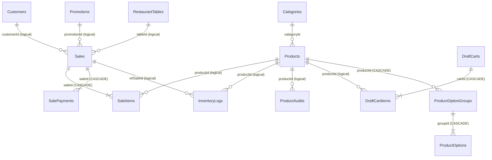

# Database Handbook — Promsell POS CE (v0.9.1)

Complete reference for the Promsell database: schema, relationships, indexes, migration, query patterns, backup export, and performance.

---

## Overview

| Property | Value |
|----------|-------|
| **Engine** | SQLite via [Drift](https://drift.simonbinder.eu/) (type-safe ORM) |
| **Encryption** | SQLCipher AES-256 (full-database encryption, Phase 2a) |
| **File** | `promsell_pos.db` (platform default app directory, encrypted at rest) |
| **Schema version** | **30** (v26 unique `daily_closes.close_date`; **v27** unique `sales.receipt_number`; **v28** `sale_payments` multi-tender; **v29** `products.barcode_lower` + unique index; **v30** `products.sku_lower` + unique index) |
| **Tables** | **16** |
| **ID strategy** | UUIDv4 TEXT on all tables (`IdGenerator.newId()`) |
| **Journal mode** | WAL (`PRAGMA journal_mode=WAL`) |
| **Foreign keys** | Enabled (`PRAGMA foreign_keys=ON`) |
| **Code location** | `lib/core/database/` |
| **Generated file** | `app_database.g.dart` — **do not edit** (not committed to git; run `build_runner build` to generate) |
| **Encryption key** | Mobile: platform secure storage (Keystore/Keychain). Debug desktop may use a fixed dev key — not for production. |
| **Money on disk** | Amount columns are SQLite **REAL** (baht). Domain `Money` uses integer satang in memory. |

---

## Entity-Relationship Diagram


```mermaid
erDiagram
    Categories ||--o{ Products : "categoryId"
    Sales ||--|{ SaleItems : "saleId (CASCADE)"
    Sales ||--|{ SalePayments : "saleId (CASCADE)"
    Products ||--o{ SaleItems : "productId (logical)"
    Products ||--o{ InventoryLogs : "productId (logical)"
    Products ||--o{ ProductAudits : "productId (logical)"
    Sales ||--o{ InventoryLogs : "refSaleId (logical)"
    DraftCarts ||--|{ DraftCartItems : "cartId (CASCADE)"
    Products ||--o{ DraftCartItems : "productId (logical)"
    Products ||--o{ ProductOptionGroups : "productId (CASCADE)"
    ProductOptionGroups ||--|{ ProductOptions : "groupId (CASCADE)"
    Customers ||--o{ Sales : "customerId (logical)"
    Promotions ||--o{ Sales : "promotionId (logical)"
    RestaurantTables ||--o{ Sales : "tableId (logical)"
```

### Table groupings

```
┌──────────────────────────────────────────────────────────────────────────────┐
│  Transactional (FK-enforced CASCADE)                                         │
│  ┌──────────┐   1:N  ┌─────────────┐    1:N  ┌────────────────┐              │
│  │  Sales   │ ──────▶│  SaleItems  │ ◀──────│   Products     │              │
│  └────┬─────┘        └─────────────┘         └───────┬────────┘              │
│       │ logical                               logical│                       │
│       ▼                                              ▼                       │
│  ┌──────────────┐                            ┌────────────────┐              │
│  │ InventoryLogs│                            │  Categories    │              │
│  └──────────────┘                            └────────────────┘              │
│  ┌──────────┐   1:N  ┌──────────────┐                                        │
│  │  Sales   │ ──────▶│ SalePayments │                                        │
│  └──────────┘        └──────────────┘                                        │
└──────────────────────────────────────────────────────────────────────────────┘

┌──────────────────────────────────────────────────────────────────────────────┐
│  Draft (FK-enforced CASCADE)                                                 │
│  ┌────────────┐   1:N  ┌────────────────┐                                    │
│  │ DraftCarts │ ──────▶│ DraftCartItems │ ◀── logical ── Products           │
│  └────────────┘        └────────────────┘                                    │
└──────────────────────────────────────────────────────────────────────────────┘

┌──────────────────────────────────────────────────────────────────────────────┐
│  Key-Value / Audit (no FK)                                                   │
│  ┌──────────────┐  1:1   ┌────────────────┐  ┌────────────────┐             │
│  │  AppSettings │        │  DailyCloses   │  │ ProductAudits  │             │
│  └──────────────┘        └────────────────┘  └────────────────┘             │
└──────────────────────────────────────────────────────────────────────────────┘

┌──────────────────────────────────────────────────────────────────────────────┐
│  Restaurant & CRM (v0.8.9+)                                                  │
│  ┌──────────────────┐  1:N  ┌─────────────────────┐                          │
│  │ ProductOptionGrp │ ────▶│   ProductOptions    │                          │
│  └──────────────────┘       └─────────────────────┘                          │
│  ┌──────────────────┐       ┌─────────────────────┐                          │
│  │    Customers     │       │    Promotions       │                          │
│  └──────────────────┘       └─────────────────────┘                          │
│  ┌──────────────────┐       ┌─────────────────────┐                          │
│  │ RestaurantTables │       │                     │                          │
│  └──────────────────┘       └─────────────────────┘                          │
└──────────────────────────────────────────────────────────────────────────────┘
```

### Relationship notes

| Relationship | FK enforced? | Why |
|-------------|-------------|-----|
| `sale_items.saleId → sales.id` | **Yes** (CASCADE) | Deleting a sale must cascade to its items |
| `draft_cart_items.cartId → draft_carts.id` | **Yes** (CASCADE) | Deleting a draft must cascade to its items |
| `sale_items.productId → products.id` | **No** (logical) | Sale history must survive product deletion |
| `inventory_logs.productId → products.id` | **No** (logical) | Audit trail must survive product deletion |
| `inventory_logs.refSaleId → sales.id` | **No** (logical) | Log must survive even if sale is hard-deleted |
| `products.categoryId → categories.id` | **Yes** (Drift FK, `onDelete: KeyAction.setNull`) | Code uses `references(Categories, #id, onDelete: KeyAction.setNull)`; deleting a category nulls `categoryId` on its products |
| `sale_payments.saleId → sales.id` | **Yes** (CASCADE) | Multi-tender lines (schema **v28**) |
| `product_audits.productId → products.id` | **No** (logical) | Audit trail must survive product deletion |

> Full ERD with all columns: [`docs/database/schema-reference.md`](database/schema-reference.md)

---

## Sync metadata columns (not a sync engine)

These columns exist on **most** tables (schema v11+). They are **metadata only** — CE has **no** sync engine, outbox, or multi-device protocol (ADR-028). `deviceId` was backfilled on six tables in schema v13. `ProductAudits` has no `deletedAt`. Sale/void stock updates do **not** always `version++` (V092-C.1).

| Column | Type | Purpose |
|--------|------|---------|
| `version` | INTEGER (default 1) | Optimistic concurrency — increment on each update |
| `deviceId` | TEXT (nullable) | Identifies which device created/modified the row |
| `updatedAt` | DATETIME | Last modification timestamp for conflict resolution |
| `deletedAt` | DATETIME (nullable) | **Soft delete** — row is hidden but not physically removed |

### Soft delete pattern

When a record is "deleted":
1. Set `deletedAt = DateTime.now()` instead of `DELETE FROM`
2. All queries filter `WHERE deleted_at IS NULL` (or use `isActive` for products)
3. Sync can detect deletions by comparing `deletedAt` timestamps

> Products use `isActive` for soft deactivation in the UI layer. The `deletedAt` column enables true soft-delete + sync in Phase 4.

### Sync column flow

```
              Local Write (insert/update/delete)
                              │
                              ▼
              ┌───────────────────────────────┐
              │  version++                    │
              │  updatedAt = now()            │
              │  deviceId = this.device       │
              │  deletedAt = now()? (soft)    │
              └───────────────┬───────────────┘
                              │
                              ▼
              ┌───────────────────────────────┐
              │  Local SQLite (WAL)           │
              │  16 tables; metadata columns  │
              │  (not a sync engine)          │
              └───────────────┬───────────────┘
                              │
             Not in CE v1     │
              ┌───────────────▼───────────────┐
              │  No sync engine               │
              │  (ADR-028 non-goal)           │
              └───────────────────────────────┘
```

---

## Migration timeline

```
v1          v2          v5          v7          v8          v10
│           │           │           │           │           │
▼           ▼           ▼           ▼           ▼           ▼
Initial     Draft      Image       is_archived Daily       Rebuild
	schema      discounts  settings    on drafts    Closes      daily_closes

v11         v12         v13         v14         v15         v16      v17       v18       v19
│           │           │           │           │           │        │         │         │
▼           ▼           ▼           ▼           ▼           ▼        ▼         ▼         ▼
Sync        Timestamp   Backfill    Category    Category    Unique   Auto-     Barcode  CartItem
columns     INT ms      deviceId    FK + UUID   color/icon  barcode  dedup     images   note
(6 tables)  conversion  (all rows)  backfill    presets     index    barcodes

v20                                           v21                                v22
│                                             │                                  │
▼                                             ▼                                  ▼
Restaurant tables + Product options           Customer + Promotion tables        Product
+ order type/channel/service charge           + customer/promotion refs          description

v23                                           v24
	│                                             │
	▼                                             ▼
	Runtime validations: barcode uniqueness       Partial unique barcode index
	barcode length constraints                    (WHERE barcode NOT NULL / not empty)
	
	v25                                           v26
	│                                             │
	▼                                             ▼
	Products brand / unit / supplier              Dedupe daily_closes by close_date
	+ is_recommended                              Unique index on close_date

	v27                                           v28
	│                                             │
	▼                                             ▼
	Dedupe sales.receipt_number                   sale_payments multi-tender table
	Unique partial index on receipt_number        + index on sale_id

	v29                                           v30
	│                                             │
	▼                                             ▼
	products.barcode_lower + unique index         products.sku_lower + unique index
	(case-insensitive barcode lookups)            (case-insensitive SKU lookups)
	```
	
	---
	
	## Security & Encryption (Phase 2a)
	
	Promsell POS CE uses **SQLCipher** for full-database encryption at rest.
	
	| Feature | Implementation (app code) |
	|---------|---------------------------|
	| **Open path** | `EncryptedDatabaseOpener` + `DbKeyStore` (`lib/core/database/`) |
	| **Key PRAGMA** | `PRAGMA key="x'<hex>'"` only (library defaults for other cipher settings) |
	| **Key storage** | Mobile secure storage; debug desktop may use a fixed dev key |
	| **Plain → encrypted** | One-time migrate via `sqlcipher_export` when opening a legacy plain file |
	| **Dependencies** | `sqlcipher_flutter_libs: ^0.6.0`, `sqlite3`, `flutter_secure_storage` |
	
	### Key management flow
	
	```
	First launch (mobile)
	    ↓
	Generate secure random key → store in secure storage
	    ↓
	Open NativeDatabase + PRAGMA key
	    ↓
	If plain legacy DB exists → encrypt migrate → ready
	```
	
### Backup export & same-device restore

- **CSV exports**: Plaintext (user-controlled)
- **Full DB export**: WAL checkpoint → copy → optional **AES-256-GCM** package with PIN (≥ 6) via Settings → Backup (default encrypt **on**)
- **In-app restore**: **Yes — same-device only** (Settings → Backup). Restores `.enc` or SQLCipher `.db`; rejects plain SQLite. Needs this device’s SQLCipher key in secure storage. Cross-device / after uninstall = **not** supported (Phase 2b)
- **Cloud sync**: not in CE 0.9

> **Note**: Losing the SQLCipher key (uninstall / keystore wipe) without an export means **permanent data loss**. Key recovery is not available in 0.9.1 (Phase 2b deferred).

---

## Reference documents

| Document | Content |
|----------|---------|
| [`docs/database/schema-reference.md`](database/schema-reference.md) | All **16** tables with column details, indexes, seed data, enum values |
| [`docs/database/query-patterns.md`](database/query-patterns.md) | Drift query patterns: watch products, insert sale, void sale, date range, draft upsert |
| [`docs/database/migration-and-ops.md`](database/migration-and-ops.md) | Migration guide (v2→**v30**), backup export/restore, encrypted backups, performance notes, DB testing |

---

### Schema v25–v30

| Version | Changes |
|---------|---------|
| **v25** | Products: nullable `brand`, `unit`, `supplier`; `is_recommended` |
| **v26** | Unique index on `daily_closes(close_date)` after dedupe (one close per business day) |
| **v27** | Unique partial index on `sales(receipt_number)` after dedupe; receipt sequence reseeds from max on disk |
| **v28** | `sale_payments` multi-tender table + index on `sale_id` |
| **v29** | `products.barcode_lower` column + unique partial index for case-insensitive barcode lookups |
| **v30** | `products.sku_lower` column + unique partial index for case-insensitive SKU lookups |

**Money on disk:** amount columns remain SQLite **REAL** (baht). Domain code uses the `Money` value object (integer satang) and maps at the data layer. Integer column storage is deferred (Phase M).

**Backup:** Export + AES-GCM (PIN ≥ 6; default **on** when setting missing). **Same-device in-app restore** is shipped; cross-device is not. SQLCipher key lives in platform secure storage; **key loss = data loss** without a backup.

---

<sub>Promsell POS CE · Schema v30 · 16 tables · UUIDv4 · SQLCipher AES-256</sub>