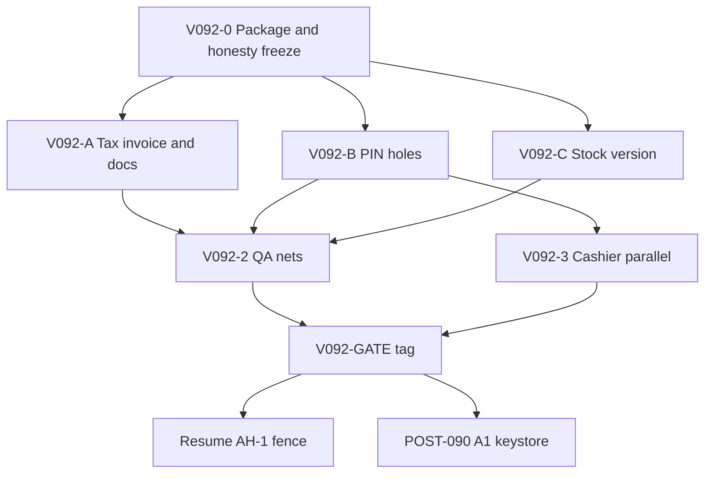

# v0.9.2 — Integrity Slice Overview

**Package:** `docs/plan/COMPLETE/V092-INTEGRITY/`  
**Version target:** `0.9.2+1` (schema **v30** baseline; **v31 only if a repair** is required — SKU dedupe / small audit column)  
**Branch base:** `main` (post v0.9.1, current working tree)  
**Capacity model:** Solo maintainer · part-time (~6–10 h/week)  
**Horizon:** ~4–8 weeks flexible (no hard day calendar)  
**Status:** **COMPLETE — GATE UNLOCKED** (2026-08-14) — all G1–G11 signed; `v0.9.2` may be cut  
**IDs:** **V092-*** only. Do not reuse `AH-*` / `A1–A5` / `B0–B5` / `C1–D4` / `E0–E4`

---

## Goal

Close the gaps that made the 2026-08-13 audit conclude **v0.9.1 is an engineering trust cut, not a merchant trust cut** — without expanding into Play production, Phase M, or multi-device.

1. **Honesty** — code, listing, CHANGELOG, and SECURITY speak the same language (especially tax invoices, PIN, CI, schema).
2. **Staff control** — every path that changes money / stock / price / day-close / export actually goes through the store PIN, not only some use cases.
3. **Stock integrity** — a stale product form cannot overwrite stock after a sale; every stock mutation is atomic and bumps `version`.
4. **QA nets** — one host suite for VAT + discount + void + day-close, plus a device void with a known PIN.
5. **Cashier survive** — tablet dual-pane can actually rotate, DB/PDF open off the UI isolate, barcode scan is not limited to the first 500 rows.

**Non-goal this package (leave to existing SSOTs — do not copy their checklists):**

| Out of 0.9.2 scope | SSOT |
|--------------------|------|
| Domain import fence / CloseDay port / full ADR-011b | [ARCH-HARDEN-1.0](../UN-COMPLETE/ARCH-HARDEN-1.0/OVERVIEW.md) |
| Play production A1–A5, Console Data safety, throwaway ≠ prod JKS | [POST-090 WS-A](../COMPLETE/POST-090-MANAGE/WS-A-PLAY-PRODUCTION.md) |
| INTEGER satang on disk (Phase M) | [WS-C](../COMPLETE/POST-090-MANAGE/WS-C-PHASE-M-MONEY.md) |
| Key export / cross-device restore (Phase 2b) | [WS-D](../COMPLETE/POST-090-MANAGE/WS-D-PHASE-2B-KEY-RESTORE.md) |
| Bluetooth thermal / cash drawer | [WS-E E2](../COMPLETE/POST-090-MANAGE/WS-E-PRODUCT-UX.md) |
| Full multi-user / shifts / RBAC | ARCH-HARDEN `AH-C.3` (later) |
| iOS App Store cut | Out of this CE slice |
| Vanity god-file splits (`app_theme`, 143 settings files) | `AH-C.5` after money nets |

---

## Why this package exists

The 8-track parallel audit (2026-08-13) scored the project **~6.3/10** and pointed at the same P0 set:

| Audit P0 | Why it belongs in 0.9.2, not “wait for 1.0” |
|----------|---------------------------------------------|
| Product form can overwrite stock because sale does not `version++` | On-hand counts can lie today |
| Price/stock edits skip PIN | SECURITY §8 overclaims |
| Receipt path claims a Thai tax invoice when Tax ID is set | Revenue-department + Play risk |
| Device void never closed on a real/emulator walk | Cashier path merchants actually touch is untested |
| Docs and CI/AAB tell different stories | A human tagging `v*` will decide wrong |

Play / Phase M / fences are already owned by older plans. **0.9.2 is the honesty-and-integrity repair slice before those resume** — not a second 1.0 warehouse.

---

## Relationship to other plans

| Plan | Role vs this package |
|------|----------------------|
| [V090-TRUST](../../COMPLETE/V090-TRUST/V090-TRUST-OVERVIEW.md) | Predecessor — GitHub trust-cut **COMPLETE** |
| [DOC-SSOT](../UN-COMPLETE/DOC-SSOT/OVERVIEW.md) | **Docs-tree honesty** (plan git, README, handbooks) — does **not** replace V092-A/D or block this tag |
| [ARCH-HARDEN-1.0](../UN-COMPLETE/ARCH-HARDEN-1.0/OVERVIEW.md) | **Sequencing SSOT for architecture-before-Play** — 0.9.2 does **not** unlock AH-GATE-1 |
| [POST-090-MANAGE](../COMPLETE/POST-090-MANAGE/POST-090-OVERVIEW.md) | **Store / QA 1.0 / Phase M / 2b / UX SSOT** — 0.9.2 may reuse test nets; it does not execute A4/A5/C1/D2 |
| This package | **Release-slice SSOT for tag `v0.9.2`** |
| [roadmap.md](../../../readme/roadmap.md) | Public mirror — must point here in §Next |

**Rules:**

- Do not copy A1–A5 / AH-G1–G6 / Phase M C1–C4 checklists into this folder — link only.
- Do not mark AH / POST-090 items done from this folder.
- If the same finding appears twice, add a “Covered by” row in [BACKLOG.md](./BACKLOG.md) and point at the original ID.
- The `docs/plan/COMPLETE/` move is still an uncommitted working-tree change — this package links only the new paths.

---

## Principles (Locked)

| Topic | Decision |
|-------|----------|
| Money path | **Behavior-preserving** — do not change payable / VAT / tender order by accident |
| Docs | **SSOT = code** — withdraw the claim first, then add features |
| PIN | Every path docs call sensitive must be gated in **domain**, not only one sheet |
| Stock | Write with `stock = stock ± ?` or re-read then compare version — **never** write the on-hand qty from a stale form |
| Receipt | Tax ID may display; the document type is always a **sales receipt** until a separate e-Tax program exists |
| Schema | Avoid table rebuilds; v31 only for repairs (dedupe / nullable columns) — **not** Phase M |
| Play | Tag `v0.9.2` ≠ Play production; still **No-Go** under AH-GATE-1 |
| God files | Do not split `app_theme` / `app_database` wholesale this slice unless a v31 migration extract is required |
| WIP | ≤1 money/stock theme per week (solo) |
| Done means | PR + green tests + related docs — never memory-only |

---

## Workstreams

| WS doc | Theme | Blocks the tag? |
|--------|-------|-----------------|
| [WS-V092-A-HONESTY.md](./WS-V092-A-HONESTY.md) | Withdraw tax-invoice claim · sync docs/CI/listing | **Yes** (P0) |
| [WS-V092-B-STAFF.md](./WS-V092-B-STAFF.md) | PIN on every entry · lock at launch · backup leftovers | **Yes** (P0) |
| [WS-V092-C-STOCK.md](./WS-V092-C-STOCK.md) | `version++` · no stale overwrite · migrate hygiene | **Yes** (P0) |
| [WS-V092-D-QA.md](./WS-V092-D-QA.md) | Host VAT+void+close · 5-case device smoke · E2E doc honesty | **Yes** (some P0) |
| [WS-V092-E-CASHIER.md](./WS-V092-E-CASHIER.md) | Tablet · isolate DB/PDF · full-catalog scan | Should for the tag; Must if we claim tablet |
| [GATE-TO-TAG.md](./GATE-TO-TAG.md) | Criteria to unlock tag `v0.9.2` | Tag |
| [BACKLOG.md](./BACKLOG.md) | Must / Should / Could + full audit map | Daily tracker |

---

## Execution waves (no hard calendar)

```
V092-0  Package + audit map + doc freeze          (2–4 days PT)   ← NOW
V092-1  P0 money/truth: tax + PIN holes + stock version
        (2–3 weeks PT)                                            ★ critical path
V092-2  QA nets: host VAT/void/close + device void PIN
        (1–2 weeks PT, may start at the tail of V092-1)
V092-3  Cashier survive: orientation / isolate / scanner
        (slow-parallel after P0 green)
V092-4  V092-GATE → tag v0.9.2 → resume AH-1 + POST-090 A1
```



### Ordering bans

1. Do **not** tag `v0.9.2` before V092-GATE (see [GATE-TO-TAG.md](./GATE-TO-TAG.md)).
2. Do **not** start Phase M / god-file splits / thermal before P0 money+PIN is green.
3. Do **not** upload Play production or use a throwaway JKS as the store key — still POST-090.
4. Do **not** hard-gate all of `integration_test/all_tests.dart` until the 5 core cases are green 3 times.
5. Do **not** add restaurant / new languages / CRM in this slice.

---

## Go / No-Go

| Channel | Status after this package closes |
|---------|----------------------------------|
| GitHub tag `v0.9.2` | **Go** ✅ (V092-GATE unlocked 2026-08-14) |
| Sideload, owner-operated single device | **Conditional Go** — lock the OS screen + read backup limits |
| Play internal/closed | **Not a 0.9.2 goal** — POST-090 after AH-GATE-1 |
| Play production / the words “v1.0” | **No-Go** unchanged |
| “Ready for a shop with staff” | **No-Go** — still one shared PIN + optional light actor, not shifts/roles |
| “Tax invoice” / “sync-ready” / “E2E ready” | **No-Go** — do not claim |

---

## RACI (solo part-time)

| Work | Role |
|------|------|
| V092 plan package | Maintainer **A/R** |
| P0 code (tax / PIN / stock) | Maintainer **A/R** |
| Device smoke + test PIN | Maintainer **A/R** |
| Production JKS / Play Console | Operator — **out of the 0.9.2 tag** (POST-090) |
| Community PRs | **C** |

---

## Risk register

| Risk | L | I | Mitigation |
|------|---|---|------------|
| Product-form change breaks live sales | M | C | Overwrite-regression test + CAS `stock = stock ± ?` before merge |
| Wider PIN gates lock cashiers out | M | H | Keep current 2-minute grace until UX tests exist; treat cold-start lock as separate from void |
| Withdrawing tax-invoice title upsets shops that relied on the header | L | M | Tax ID still prints as shop data, not as document type |
| Flaky device smoke blocks the tag | H | H | 5 cases + stable Keys; do not gate the whole `all_tests.dart` suite |
| Plan collides with AH / POST-090 | M | H | Separate ID families + Covered-by table |
| Working tree too large to review | H | M | Small PRs per wave; do not squash everything into one commit |
| v31 SKU repair prevents app open | L | C | Dedupe before unique, same as barcode + fixture upgrade from v30 |

---

## Success metrics

Tag `v0.9.2` succeeds when:

- [x] Receipt header/type does **not** become a tax invoice when Tax ID is set
- [x] Changing `products.stock` / `price` / `cost` from the product form or quick-edit requires PIN if store PIN is on
- [x] A sale followed by saving a stale product form **does not** restore old stock
- [x] Host integ: EXCLUSIVE 7% + discount + void restock + day-close is green as one suite
- [x] Device: History void with a known PIN succeeds on an emulator at least once, recorded in smoke notes
- [x] SECURITY / CHANGELOG / STORE_SUBMISSION / testing.md no longer contradict YAML
- [x] `flutter analyze` 0 issues · trust suite green · coverage still ≥ 60 global / 80 sale-logic

Not metrics for this slice: whole-app 80% coverage, Play installs, thermal, cross-device restore.

---

## Audit source (2026-08-13)

This package’s source of truth is the elite-orchestrate report (not vibes):

| Track | Score | P0 absorbed into V092 |
|-------|------:|------------------------|
| Architecture | 6.5 | Honesty around ADR/sync-ready (partly links AH-0.3) |
| Security | 6.5 | H1–H4, M1, some M4/M8 |
| Database | 7.0 | Stock version overwrite, migrate hygiene |
| Mobile | 7.0 | Orientation, isolate, scanner 500 |
| DevOps | 6.5 | Docs↔workflow, smoke flavor |
| Test | 6.5 | VAT integ, device void, E2E honesty |
| Trust / Product | 6.0 / 5.0 | Tax-invoice claim, PIN doc drift |

The complete audit map (including items **not** done in 0.9.2) lives at the end of [BACKLOG.md](./BACKLOG.md) §Audit coverage map.

---

## Child doc index

| Doc | Role |
|-----|------|
| [OVERVIEW.md](./OVERVIEW.md) | Sequencing SSOT / relationships / waves |
| [BACKLOG.md](./BACKLOG.md) | Must/Should/Could status + audit map |
| [GATE-TO-TAG.md](./GATE-TO-TAG.md) | Criteria for tag `v0.9.2` |
| [WS-V092-A-HONESTY.md](./WS-V092-A-HONESTY.md) | Docs and claim honesty |
| [WS-V092-B-STAFF.md](./WS-V092-B-STAFF.md) | PIN / app lock / backup leftover |
| [WS-V092-C-STOCK.md](./WS-V092-C-STOCK.md) | Stock / version / migrate |
| [WS-V092-D-QA.md](./WS-V092-D-QA.md) | Tests / smoke / CI honesty |
| [WS-V092-E-CASHIER.md](./WS-V092-E-CASHIER.md) | Tablet / ANR / scan |

---

<sub>Promsell POS CE · V092-INTEGRITY · honesty + staff + stock slice · 2026-08-13</sub>
