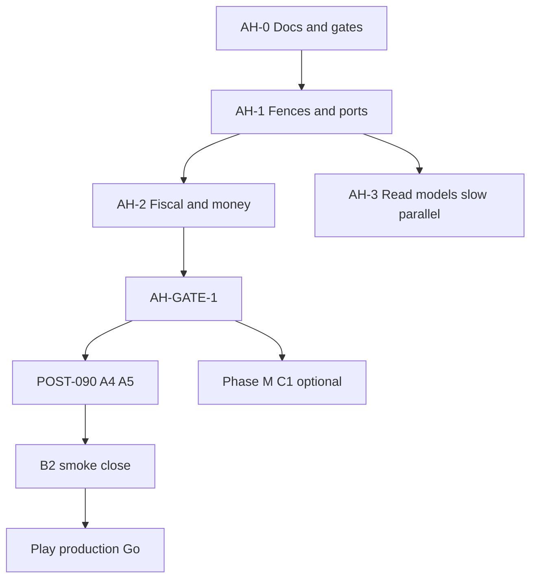

# Architecture Hardening 1.0 — Management Overview

**Package:** `docs/plan/UN-COMPLETE/ARCH-HARDEN-1.0/`  
**Version target:** Architecture base ready **before** Play production cut  
**Branch base:** `main` (post v0.9.1, schema **v30**)  
**Capacity model:** Solo maintainer · part-time (~6–10 h/week)  
**Horizon:** ~10–14 weeks flexible (no hard day calendar)  
**Status:** **PAUSED until V092-GATE** (2026-08-13) — AH-0.3 ADR wording may land via DOC-SSOT; do not start AH-1 fences until the tag gate unlocks  

**IDs:** **AH-*** only (do not renumber POST-090 A–E)

---

## Goal

 Harden modular / fiscal / operability architecture **before** resuming the Play production critical path, without diluting the v0.9.0 money-path trust cut.

1. **Dependency fences** — domain purity enforceable in CI  
2. **Fiscal concurrency** — day lock inside write TX; close-day atomicity  
3. **Money boundary** — presentation/domain consistency; Phase M gated  
4. **Read-model ports** — History / Report / CloseDay / Home stop leaking sale data  
5. **Honest docs + AH-GATE-1** — unlock POST-090 Play production only after gate  

**Non-goal this package:** implement multi-device sync, SOC2, iOS store full cut, or Phase 2b key export code.

---

## Relationship to other plans

| Plan | Role vs this package |
|------|----------------------|
| [V090-TRUST](../../COMPLETE/V090-TRUST/V090-TRUST-OVERVIEW.md) | Predecessor — GitHub trust-cut **COMPLETE** |
| [V092-INTEGRITY](../V092-INTEGRITY/OVERVIEW.md) | **Release slice `v0.9.2`** — honesty / PIN holes / stock CAS / QA nets; **does not** unlock AH-GATE-1 |
| [DOC-SSOT](../DOC-SSOT/OVERVIEW.md) | **Docs-tree SSOT** — plan index, handbook, ARCH wording implement slice for AH-0.3; **does not** mark AH-0.3 done |
| [POST-090-MANAGE](../POST-090-MANAGE/POST-090-OVERVIEW.md) | **Store / QA / Phase M / 2b / UX SSOT** — still valid; **Play production (A4/A5) additionally gated by AH-GATE-1** |
| This package | **Sequencing SSOT for architecture hardening** |
| [roadmap.md](../../../readme/roadmap.md) | Public mirror — points here for arch-first path |

**Rule:** Do not duplicate A1–A5 checklists here. Link POST-090. Do not mark POST-090 items done from this folder.

---

## Principles (Locked)

| Topic | Decision |
|-------|----------|
| Arch before store | **AH-GATE-1** must pass before claiming Play production path unlocked |
| Claims | No “sync-ready”, “Clean Architecture complete”, or multi-device until fences + ports land |
| IDs | Reuse POST-090 for store/QA/M/2b/UX; new work = **AH-*** |
| Done means | PR + tests green + related docs — never memory-only |
| WIP | **≤1 architecture theme per week** (solo part-time) |
| Money path | Behavior-preserving; expand trust tests before large schema (Phase M) |
| Phase M | After AH-1 + AH-2.1 at minimum; prefer decision (AH-2.6) before v31 |
| Phase 2b | Does **not** block AH-GATE-1; blocks “durable multi-device” product claims |
| Vanity refactors | No god-file splits ahead of money nets green |

---

## Workstreams

| WS doc | Theme | Blocks |
|--------|-------|--------|
| [WS-AH-FENCE.md](./WS-AH-FENCE.md) | Domain import fence, CloseDay port, Settings purity | AH-GATE G1–G2 |
| [WS-AH-FISCAL.md](./WS-AH-FISCAL.md) | Day-lock-in-TX, close atomicity, money/policy | AH-GATE G3, G6–G7 |
| [WS-AH-READMODEL.md](./WS-AH-READMODEL.md) | SalesQueryPort, UI DI discipline | Post-gate quality |
| [WS-AH-OPS.md](./WS-AH-OPS.md) | Doc honesty, recovery shell, ADR repairs | AH-GATE G4 |
| [GATE-TO-PLAY.md](./GATE-TO-PLAY.md) | Checklist unlocking POST-090 A4/A5 path | Store critical path |
| [BACKLOG.md](./BACKLOG.md) | AH-* Must / Should / Could status table | Daily tracker |

---

## Execution waves (no hard calendar)

```
	AH-0  Honesty & package          (1–2 weeks PT)   PAUSED until V092-GATE
	AH-1  Fences + domain ports      (2–4 weeks PT)   ★ critical path after resume
AH-2  Fiscal concurrency + money (3–5 weeks PT)   ★ critical path
AH-3  Read models + shell        (2–3 weeks PT)   parallel-slow / after AH-1
AH-4  AH-GATE-1 → resume POST-090 Play            after AH-1 + AH-2 min
```



### Ordering bans

1. Do **not** start large Phase M (C1+) before AH-1 + AH-2.1  
2. Do **not** Play production upload (A4/A5) before AH-GATE-1  
3. Do **not** ship key export before D0 + SECURITY/PRIVACY (POST-090)  
4. Do **not** vanity-split god widgets before money nets stay green  

---

## Go / No-Go

| Channel | Status rule |
|---------|-------------|
| ARCH-HARDEN package | **Go** when files exist + roadmap points here |
| AH-GATE-1 | **No-Go** until G1–G6 (G7 recommended) — see [GATE-TO-PLAY.md](./GATE-TO-PLAY.md) |
| Play **production** | **No-Go** until AH-GATE-1 **and** POST-090 A1–A5 + B2 Must |
| Play internal/closed | Prefer after AH-GATE-1; operator may dry-run signing earlier without production claim |
| Phase M schema | No-Go before AH-2.6 decision + existing B1 |
| “Sync-ready” marketing | **No-Go** for CE until explicit multi-device program (not this package) |

---

## RACI (solo part-time)

| Work | Role |
|------|------|
| ARCH-HARDEN docs | Maintainer **A/R** |
| AH-1…AH-3 code | Maintainer **A/R** |
| Play Console / prod JKS | Operator **A/R** (may be same person) — **after** AH-GATE-1 for production path |
| Community PRs | **C** |
| Thermal / extra l10n | Could / help wanted |

---

## Risk register

| Risk | L | I | Mitigation |
|------|---|---|------------|
| Solo burn-out / plan too long | M | H | Small waves; ship AH-0 first; cut Could |
| Domain fence reds whole repo | H | M | Dated allowlist; fix feature-by-feature |
| CloseDay refactor breaks daily close money | M | H | `multi_tender_daily_close` + release-trust before merge |
| Day-lock-in-TX contention | L | M | Short settings read in TX; tests |
| Drift to Play before gate | M | H | GATE-TO-PLAY + roadmap wording |
| Dual SSOT vs POST-090 | M | M | Two-way links; no copied A1–A5 bodies |
| Phase M too large for solo | H | H | AH-2.6 = decision or converter-only first |

---

## Success metrics

| Metric | Target |
|--------|--------|
| AH-0 package files | 7/7 present |
| Domain fence violations on main | 0 outside dated allowlist |
| CloseDay → sale **data** imports | 0 |
| `release-trust` | Stays green |
| Coverage claims in SECURITY / testing docs | Match CI (**60%** global + **80%** sale-logic) |
| Play production claims | 0 until AH-GATE-1 + POST-090 Must |
| WIP | ≤1 arch theme / week |

---

## Baseline debts (from elite architecture analysis)

Evidence anchors (not an exhaustive bug list):

| Debt | Example path |
|------|----------------|
| CloseDay domain → sale data | `lib/features/daily_close/domain/usecases/close_day.dart` |
| Settings domain → Flutter | `lib/features/settings/domain/entities/settings.dart` |
| Day lock outside write TX | `create_sale.dart` vs `sale_insert_writer.dart` |
| MoneyConverter unused on tables | `lib/core/database/money_converter.dart` + `tables/*` |
| Doc coverage floor stale | ✅ Fixed — `SECURITY.md` now says 60% (matches `ci.yml`) |
| ADR-015 ≠ sync engine | schema columns only |
| No boot recovery shell | `lib/main.dart` optimistic boot |

Fiscal **write** spine (insert/void TX, payable calculator, SQLCipher) remains a strength — do not regress it.

---

## Child doc index

| Doc | Purpose |
|------|---------|
| [BACKLOG.md](./BACKLOG.md) | Status table AH-* |
| [WS-AH-FENCE.md](./WS-AH-FENCE.md) | Fence + purity |
| [WS-AH-FISCAL.md](./WS-AH-FISCAL.md) | Fiscal / money |
| [WS-AH-READMODEL.md](./WS-AH-READMODEL.md) | Read ports + UI DI |
| [WS-AH-OPS.md](./WS-AH-OPS.md) | Ops + doc honesty |
| [GATE-TO-PLAY.md](./GATE-TO-PLAY.md) | Unlock Play path |

---

<sub>Promsell POS CE · ARCH-HARDEN-1.0 · Architecture before Play · 2026-07-30</sub>
