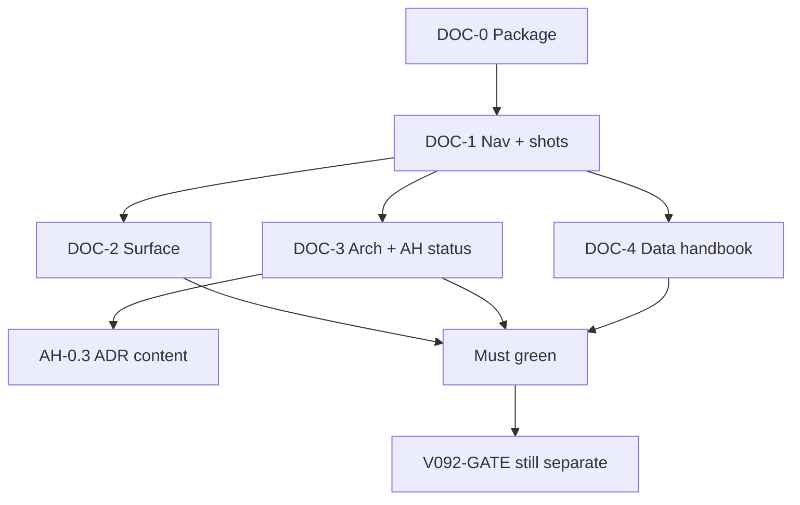

# DOC-SSOT — Documentation honesty package

**Package:** `docs/plan/UN-COMPLETE/DOC-SSOT/`  
**Version target:** docs tree on `main` (post v0.9.1 working tree). Does **not** cut a product version.  
**Branch base:** `main`  
**Capacity model:** Solo maintainer · part-time  
**Horizon:** 1–3 weeks PT (docs only)  
**Status:** **READY TO EXECUTE** (2026-08-13) — created from the elite-orchestrate docs audit  
**IDs:** **DOC-*** only. Do not reuse `V092-*` / `AH-*` / `A1–A5`

---

## Goal

Make the documentation tree **safe to clone, cite, and implement from** without inventing a second 0.9.2 tag slice or a Play gate.

1. **Navigable** — plan tree is committed as one COMPLETE/UN-COMPLETE move; `docs/plan/index.md` is the map.
2. **Honest architecture** — layer rules, WatchReport/Void owners, sync metadata ≠ sync engine.
3. **Safe data handbook** — nobody upgrades from `migration-and-ops.md` and bricks a shop DB.
4. **Honest surface** — README images/version, USAGE flavors, SECURITY/STORE/CI wording match YAML and code *except* where V092 still owns the claim.

**Non-goal:** rewrite `lib/` (except citing evidence). Do not implement PIN/stock/tax-invoice code. Do not mark `RELEASE_1.0_SMOKE` Pass. Do not fold this package into V092-GATE.

---

## Why this package exists

The 2026-08-13 docs audit scored the tree **~6.0/10**. V092-INTEGRITY already owns **product-claim** honesty for tag `v0.9.2` (tax invoice, PIN holes, E2E table, AAB sentence in G4). ARCH-HARDEN already owns **AH-0.3** as the ADR-content ID.

What those packages do **not** own:

| Gap | Why it hurts |
|-----|----------------|
| `docs/plan` split-brain (old paths `D`, new trees untracked) | Next docs-only commit can drop the plans |
| No `docs/plan/index.md` | Two “NOW” needles (V092 vs AH-0) |
| `migration-and-ops.md` contradicts `onUpgrade` | Following the handbook can fail a v16/v30 upgrade |
| ARCHITECTURE / C4 still sell purity + sync-ready | Contributors design the wrong system |
| README 5 dead screenshot hrefs + `90+` keys + tag `v0.9.1` | GitHub first impression is false |
| AH-2.1 / **AH-G3** still `todo` while `SaleDayGuard` is in-TX | Duplicate fiscal work |

---

## Relationship to other plans

| Plan | This package OWNS | This package LINKS only |
|------|-------------------|-------------------------|
| [V092-INTEGRITY](../V092-INTEGRITY/OVERVIEW.md) | nothing in V092-A.1–A.4 / D.3 / V092-G1–G3 / G5–G8 | tax-invoice **code**, PIN/CI/E2E claim sweep, V092-GATE **G4** |
| [ARCH-HARDEN-1.0](../ARCH-HARDEN-1.0/OVERVIEW.md) | nav wrap, pause AH-0 until V092-GATE, mark AH-2.1 from evidence | **AH-0.3 remains the ADR ID** — do not mark done without the ADR PR |
| [POST-090-MANAGE](../POST-090-MANAGE/POST-090-OVERVIEW.md) | nothing store/operator | A2 Data safety, B0, E0 |
| This package | plan git + index, README shots, data handbook, architecture wording, surface/CI/SECURITY copy that is **not** V092-G4 | — |
| [roadmap.md](../../../readme/roadmap.md) | fourth track under §Next | — |

**Rules:**

- If a finding is already `V092-A.*` / `AH-0.3`, BACKLOG says **Covered by** and stops.
- Do not copy A1–A5 / AH-G1–G7 / V092 Must tables here.
- Do not unlock Play or tag `v0.9.2` from this folder.
- Gate IDs in prose: **`V092-G*`** vs **`AH-G*`**. Never bare `G3` across packages (`V092-G3` = stock CAS, `AH-G3` = day-lock-in-TX).

---

## Principles (Locked)

| Topic | Decision |
|-------|----------|
| SSOT | Code + YAML beat handbooks. Docs describe reality, then targets. |
| Claims | Withdraw the sentence before adding a feature. |
| Tag `v0.9.2` | Not blocked by DOC Should/Could. V092-GATE G4 stays claim/YAML only. |
| Play listing tax-invoice denials | **Frozen** until V092-A.1 lands in code. |
| `RELEASE_1.0_SMOKE` | Stays **No-Go**. New evidence goes to a 0.9.2 addendum (V092-D.2). |
| Git | One commit pairs `COMPLETE/` + `UN-COMPLETE/` adds with old-path deletes. |
| WIP | One docs theme per PR (nav / surface / arch / data). |
| Done means | PR + `rg` verification in the WS file — never memory-only. |

---

## Workstreams

| WS doc | Theme | Blocks clone honesty? |
|--------|-------|------------------------|
| [WS-DOC-NAV.md](./WS-DOC-NAV.md) | Plan git, `index.md`, relative links, AH pause, gate prefixes | **Yes** |
| [WS-DOC-SURFACE.md](./WS-DOC-SURFACE.md) | README / USAGE / CONTRIBUTING / SECURITY / STORE / CI.md | **Yes** (shots + version + flavors) |
| [WS-DOC-ARCH.md](./WS-DOC-ARCH.md) | ARCHITECTURE / C4 / ADR-015 / ADR-027–028 via AH-0.3 | Should |
| [WS-DOC-DATA.md](./WS-DOC-DATA.md) | migration-and-ops / schema-reference / query-patterns | Should (P0 if anyone migrates from docs) |
| [BACKLOG.md](./BACKLOG.md) | Must / Should / Could + Covered-by | Daily |

No `GATE-TO-DOCS.md`. Closing this package = all Must green + optional move to `docs/plan/COMPLETE/`.

---

## Execution waves

```
DOC-0  This package + roadmap pointer                         ← NOW
DOC-1  Plan tree commit + index + README shots + USAGE flavor ★ first PR
DOC-2  Surface honesty (PIN/AAB/Privacy/CI.md) that V092-G4 does not uniquely own
DOC-3  Architecture wording + AH-2.1/AH-G3 status + AH-0 pause
DOC-4  Data handbook (migration-and-ops first)
DOC-5  Mature README (DOC-R.*) — cut chrome, status first
DOC-6  Optional: move DOC-SSOT → COMPLETE when Must+Should land
```



### Ordering bans

1. Do **not** `git add -u docs/plan` (deletes only) without adding `COMPLETE/` + `UN-COMPLETE/`.
2. Do **not** retell V092-A.1–A.4 / D.3.
3. Do **not** mark AH-0.3 done from this folder.
4. Do **not** change Play listing tax-invoice denials before V092-A.1.
5. Do **not** claim a domain fence or “Clean Architecture complete.”
6. Do **not** write a v31 unique-SKU recipe (V092-C.2) or Phase M (POST-090 C).

---

## Go / No-Go

| Channel | After this package |
|---------|-------------------|
| Clone `main` and follow README screenshots | **Go** when DOC-1 lands |
| Follow `migration-and-ops.md` as upgrade SSOT | **No-Go** until DOC-4 |
| Tag `v0.9.2` | Still **V092-GATE** — this package is not on that critical path |
| Play production | Still **AH-GATE-1** + POST-090 |

---

## Success metrics

- [ ] `docs/plan/index.md` exists; old `docs/plan/V090-TRUST/` (no COMPLETE) links are gone
- [ ] README screenshot hrefs exist on disk
- [ ] USAGE primary run command includes `--flavor` and `-t`
- [x] No live “secrets-optional AAB” / “PIN Optional” / “entirely offline” in **current** SSOT files
- [ ] ARCHITECTURE does not say domain has zero Flutter deps without naming leaks
- [ ] `migration-and-ops.md` does not tell readers to skip v16 dupes or drop UNIQUE at v23
- [ ] AH-2.1 / **AH-G3** marked from `SaleDayGuard`; **V092-G3** untouched
- [ ] AH-0 is **PAUSED until V092-GATE**

---

## Child doc index

| Doc | Role |
|-----|------|
| [OVERVIEW.md](./OVERVIEW.md) | Sequencing SSOT |
| [BACKLOG.md](./BACKLOG.md) | Status + Covered-by |
| [WS-DOC-NAV.md](./WS-DOC-NAV.md) | Git + index + links |
| [WS-DOC-SURFACE.md](./WS-DOC-SURFACE.md) | Product + trust + CI copy |
| [WS-DOC-ARCH.md](./WS-DOC-ARCH.md) | Architecture / ADR |
| [WS-DOC-DATA.md](./WS-DOC-DATA.md) | Database handbooks |
| [WS-DOC-README.md](./WS-DOC-README.md) | Mature public README (shape / tone) |

---

<sub>Promsell POS CE · DOC-SSOT · documentation honesty · 2026-08-13</sub>
